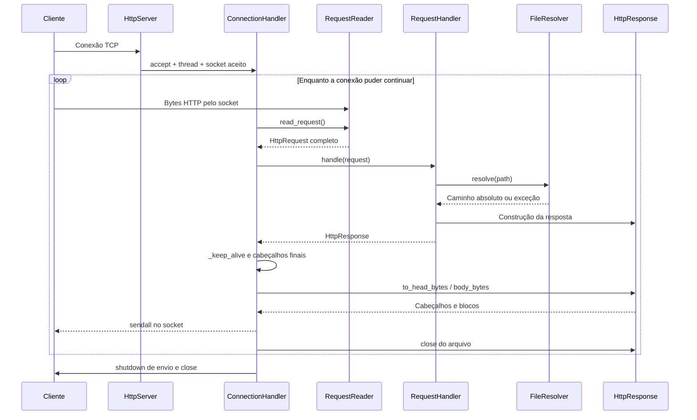

# Entendendo o Trabalho 1 por dentro

**Material de estudo do grupo — não incluir na entrega ao professor.**

Base da explicação: código local revisado em 05/10/2026, após corrigir a nomenclatura. Se a implementação mudar, revisem as explicações e o inventário antes de usá-los como referência.

Este guia explica o código que está nesta pasta: o que acontece quando o programa começa,
como os objetos se relacionam, o caminho de cada pedido, as decisões em cada método e o que
os testes realmente demonstram. Os exemplos de rede são didáticos; não são medições do grupo.

A meta é conseguir abrir qualquer função e responder: **quem chega aqui, que dados traz,
o que muda, o que sai daqui e quem continua o trabalho depois?**

## Como estudar

Na primeira leitura, sigam as seções 1 a 4 e a simulação da seção 11. Depois leiam os módulos
na ordem do fluxo: `server.py` → `connection.py` → `http_parser.py` → `file_resolver.py` →
`request_handler.py` → `http_response.py`. Por último, estudem os clientes, medições e perguntas.
Abram o código ao lado do guia. Não tentem decorar os nomes antes de entender o caminho dos dados.

Para cada método, façam três exercícios: expliquem sem ler; escolham uma entrada concreta;
prevejam o que quebraria se a etapa principal fosse retirada. Os três integrantes devem
conseguir explicar o fluxo inteiro, mesmo que cada um apresente um módulo diferente.

### Índice

1. [O que estamos construindo](#objetivo)
2. [O mínimo de TCP e HTTP para entender o código](#fundamentos)
3. [O Python utilizado aqui](#python)
4. [Mapa dos módulos, objetos e dados](#mapa)
5. [server.py: iniciar, aceitar e encerrar](#servidor)
6. [connection.py: conduzir uma conversa](#conexao)
7. [http_parser.py: entender o fluxo recebido](#parser)
8. [file_resolver.py: localizar arquivos com segurança](#arquivos)
9. [request_handler.py: decidir a resposta](#handler)
10. [http_response.py: transformar a resposta em bytes](#resposta)
11. [Uma requisição inteira, passo a passo](#simulacao)
12. [Erros, HEAD, timeout e casos especiais](#casos)
13. [Concorrência e ciclo de vida dos recursos](#concorrencia)
14. [A página e os outros arquivos do trabalho](#pagina)
15. [tests/client.py: o outro lado da conversa](#cliente)
16. [Cada teste de conformidade e fluxo](#testes)
17. [Teste de concorrência e suíte local](#suite)
18. [Benchmark C1/C2, método por método](#benchmark)
19. [O que medir no Wireshark e por quê](#medicao)
20. [Prática, perguntas e limites reais](#estudo)
21. [Inventário de todas as funções e métodos](#inventario)

<a id="objetivo"></a>
## 1. O que estamos construindo

Estamos construindo um programa que recebe pedidos como “me envie `/test.txt`” e devolve
o conteúdo correspondente dentro de uma resposta HTTP. O navegador pode conversar com ele
porque os dois lados concordam com o formato dessas mensagens.

O servidor é **estático**: lê arquivos que já existem. Ele não executa código Python dentro
de HTML, não acessa banco de dados, não salva uploads e não processa um formulário de cadastro.
`GET /sub/pagina.html` significa procurar um arquivo nessa posição relativa à raiz configurada.

O desafio do trabalho é fazer isso a partir de sockets. Uma biblioteca de servidor HTTP
normalmente esconderia o parsing, o tamanho das mensagens, as conexões e os erros. Aqui nós
precisamos decidir essas coisas explicitamente.

A Parte 1 responde: **o servidor entende pedidos, devolve respostas corretas e atende
clientes sem expor arquivos indevidos?** A Parte 2 responde: **quanto custa abrir uma
conexão TCP a cada pedido e o que muda quando reutilizamos uma conexão?**

O código implementa o servidor e os instrumentos de teste. Capturar tráfego em duas máquinas,
preencher o relatório e apresentar a solução são atividades adicionais do trabalho.

<a id="fundamentos"></a>
## 2. O mínimo de TCP e HTTP para entender o código

### 2.1 Endereço IP, porta e socket

Um IP identifica uma interface de rede. A porta identifica o ponto de comunicação de um
serviço naquele endereço. No exemplo `http://192.168.1.20:8080/test.txt`, o cliente precisa
abrir uma conexão com o IP `192.168.1.20` e a porta `8080`, para então enviar um pedido HTTP.

**Socket** é o objeto pelo qual o programa conversa com a pilha de rede do sistema operacional.
Nosso código não escreve cabeçalhos IP/TCP nem calcula checksums TCP. Ele fornece bytes ao
socket; o sistema operacional cuida da transmissão TCP.

Há dois tipos de socket no servidor:

| Objeto | Para que serve | Quantidade típica |
|---|---|---|
| Socket de escuta | Aceitar novas conexões na porta 8080 | Um no servidor |
| Socket conectado | Trocar dados com um cliente específico | Um por conexão aceita |

`accept()` não transforma o socket de escuta no socket do cliente. Ele devolve **outro
socket** e o endereço do cliente. O socket de escuta continua disponível para aceitar mais gente.

`0.0.0.0` significa escutar em todas as interfaces IPv4 locais; não é o endereço para outra
máquina digitar no navegador. `127.0.0.1` aponta para a própria máquina. Por isso podemos usar
loopback em testes de software, mas não para demonstrar a medição de RTT entre computadores.

### 2.2 O que o TCP faz, e o que ele não sabe

TCP oferece um fluxo de bytes ordenado enquanto a conexão funciona. Segmentação, retransmissão
e controle de fluxo ficam abaixo da aplicação. Uma falha de conexão ainda pode interromper a
transferência: TCP não promete que o processo remoto interpretou todos os bytes enviados.

O TCP não sabe que existe um `GET`, um arquivo HTML ou um `Content-Length`. Não preserva as
fronteiras das chamadas `send` feitas pela aplicação. Uma escrita pode ser recebida em partes;
várias escritas podem aparecer juntas em uma leitura. [Referência: RFC 9293](https://www.rfc-editor.org/rfc/rfc9293.html).

Considere o cliente enviando:

```python
b'GET /test.txt HTTP/1.1\r\nHost: laboratorio\r\n\r\n'
```

Três possibilidades de leitura pelo servidor são:

```text
A — pedido fragmentado
recv 1: b'GET /te'
recv 2: b'st.txt HTTP/1.1\r\nHost: laboratorio\r\n'
recv 3: b'\r\n'

B — dois pedidos juntos
recv 1: b'[pedido A completo][pedido B completo]'

C — um pedido inteiro e o começo de outro
recv 1: b'[pedido A completo]GET /sub/pa'
recv 2: b'gina.html HTTP/1.1\r\nHost: laboratorio\r\n\r\n'
```

Os colchetes em B/C são marcações didáticas, não bytes reais. O `RequestReader` precisa
funcionar nos três casos. Essa é a razão de existir `buffer`.

### 2.3 Formato de uma requisição HTTP

```http
GET /test.txt?origem=aula HTTP/1.1
Host: laboratorio:8080
Connection: keep-alive

```

Na rede cada linha termina em `\r\n`. A linha vazia ao final cria a sequência `\r\n\r\n`.

| Parte | Exemplo | Significado no projeto |
|---|---|---|
| Método | GET | Operação pedida |
| Request-target | /test.txt?origem=aula | Caminho mais query enviados pelo cliente |
| Versão | HTTP/1.1 | Formato/política de protocolo |
| Host | laboratorio:8080 | Autoridade do destino HTTP; o código exige presença em HTTP/1.1 |
| Connection | keep-alive | Preferência de conexão; em HTTP/1.1 a persistência já é padrão |
| Linha vazia | CRLF CRLF | Fim dos cabeçalhos |
| Corpo opcional | Depois da linha vazia | Neste servidor, delimitado por Content-Length |

`Host` e `host` são o mesmo nome de campo. `GET` e `get` não são o mesmo método: os métodos
são comparados exatamente no handler, e `get` acaba em 405.

A query não faz parte do nome do arquivo. O parser guarda `path='/test.txt'` e
`query='origem=aula'`. Este servidor não usa a query para mudar o conteúdo.

### 2.4 Formato de uma resposta HTTP

Exemplo didático, com data substituída pelo instante real de envio:

```http
HTTP/1.1 200 OK
Content-Length: 32
Content-Type: text/plain; charset=utf-8
Date: Wed, 30 Sep 2026 12:00:00 GMT
Server: Grupo-Redes-T1
Connection: keep-alive

Arquivo de teste do Trabalho 1.
```

Na versão atual, `www/test.txt` ocupa 32 bytes, incluindo o fim de linha presente no arquivo.
O número não é escrito à mão pelo servidor: ele é obtido por `fstat`. Se o arquivo mudar,
a resposta deve anunciar seu novo tamanho.

`Content-Length` conta apenas os bytes do corpo, sem a status line, sem os cabeçalhos e sem
a linha vazia. Para UTF-8, contar caracteres pode dar errado: `len('ç')` é 1, mas
`len('ç'.encode('utf-8'))` é 2.

Com conexão aberta, o cliente não pode esperar o socket fechar para decidir que a resposta
acabou. Ele precisa de uma regra de delimitação. Nos nossos clientes, essa regra é
`Content-Length`; para HEAD, eles sabem que não há corpo.

### 2.5 GET, HEAD, persistência e pipelining

GET recebe cabeçalhos e conteúdo. HEAD recebe os cabeçalhos correspondentes, mas não o
conteúdo. Um HEAD de um arquivo de 32 bytes anuncia `Content-Length: 32` e envia zero bytes
de corpo. Isso também vale para páginas de erro produzidas para HEAD.

**Persistência** permite enviar outro pedido na conexão que já existe. **Pipelining** é
enviar vários pedidos nessa conexão antes de esperar todas as respostas. Nosso servidor
processa esses pedidos em ordem, um por vez por conexão. O benchmark usa persistência
sequencial, sem pipelining. [Referência: RFC 9112, seção 9](https://www.rfc-editor.org/rfc/rfc9112.html#section-9).

### 2.6 Três contagens diferentes

Não confundam:

1. **Requisições HTTP:** quantas operações como GET foram feitas.
2. **Conexões TCP:** quantas conversas TCP foram abertas.
3. **Pacotes/tramas:** como os dados apareceram na captura.

Dez GETs podem usar uma conexão. Um GET pode precisar de vários segmentos. Um `sendall`
não equivale a um pacote. Essa distinção é central para interpretar C1 e C2.

<a id="python"></a>
## 3. O Python utilizado aqui

### 3.1 Módulo, classe, objeto e método

Um arquivo `.py` é um módulo. Uma classe descreve um tipo de objeto. Um objeto é uma
instância concreta, com seu estado. Um método é uma função associada à classe.

`HttpServer` é a classe. `server` é uma instância. `server.start()` chama um método
dessa instância. Dentro dele, `self` aponta para esse mesmo objeto. `self` não é palavra
reservada: é o nome usado para o primeiro parâmetro de um método de instância.

Quando se chama `server.start()`, o Python passa a instância implicitamente. Não se
escreve `server.start(server)`. Já uma variável local como `sock` só existe naquela
chamada; `self.sock` é um atributo guardado no objeto e pode ser usado em outros métodos.

### 3.2 Nomes e importações

Usamos nomes descritivos em snake_case, como `read_request`, `server_name` e `buffer`.
`self` representa a instância e `cls` a classe em um classmethod. Constantes como
`MAX_BODY_BYTES` usam maiúsculas. Um sublinhado inicial, como em `_parse_head`, indica
um método de uso interno por convenção; não impede tecnicamente que seja chamado de fora.

```python
import socket
from dataclasses import dataclass, field
```

`socket.socket(...)` chama a API da biblioteca padrão. Nos testes há aliases úteis para
distinguir funções de mesmo nome: `from benchmark import run as benchmark` e
`from concurrency_test import run as concurrency`. O `as` muda apenas o nome local.

### 3.3 Como o construtor `__init__` é chamado

As classes escritas manualmente definem `__init__` diretamente. Exemplo real do resolver:

```python
def __init__(self, root: str) -> None:
    self.root = os.path.realpath(root)
    if not os.path.isdir(self.root):
        raise ValueError('O diretório raiz não existe')
```

Ao executar `FileResolver('./www')`, o Python cria a instância e chama esse método para
inicializá-la. Não devemos chamar o construtor uma segunda vez depois de criar o objeto.
O construtor retorna None; o resultado da expressão `FileResolver(...)` é a instância.

`RawClient` define `__enter__` e `__exit__` diretamente para participar do protocolo `with`.
Esses métodos especiais são pontos de entrada da linguagem, sem aliases artificiais.

### 3.4 Dataclasses e configuração imutável

`HttpRequest`, `HttpResponse` e `ConnectionConfig` usam dataclass. O decorador gera a
inicialização e outras operações a partir dos campos declarados; por isso não há um
`__init__` escrito nessas classes. `field(default_factory=dict)` cria um dicionário novo
por instância. [Referência: dataclasses do Python](https://docs.python.org/3.9/library/dataclasses.html).

No `HttpRequest`, dois pedidos não devem compartilhar o mesmo dicionário por acidente.
`body=b''`, por outro lado, usa bytes imutáveis, então não apresenta esse problema.

`ConnectionConfig` usa `frozen=True`, que impede reatribuir seus campos pela interface usual.
Isso não congela recursivamente os objetos referenciados. O handler continua sendo um objeto;
a segurança do compartilhamento vem também do fato de ele não guardar estado mutável de cada pedido.

### 3.5 Anotações, Optional, Iterator e classmethod

`port: int` informa o tipo esperado, mas a anotação sozinha não valida valores. É a CLI
e o código de validação que verificam os limites. `Optional[BinaryIO]` significa arquivo
binário aberto **ou** `None`. `Iterator[bytes]` informa que o método fornece blocos de bytes
ao ser percorrido.

`HttpResponse.error` tem `@classmethod`: recebe a classe em `cls`, e não uma resposta
já criada. Assim podemos chamar `HttpResponse.error(404)` para construir uma resposta.
O `return cls(...)` instancia essa classe com os dados do erro.

### 3.6 Bytes, strings, slices e desempacotamento

`'GET'` é texto Python. `b'GET'` é uma sequência de bytes. `encode` transforma texto em
bytes; `decode` faz o caminho inverso sob uma codificação definida.

`buffer[:n]` pega os primeiros n bytes; `buffer[n:]` pega o restante. O lado direito
de uma atribuição é avaliado antes de atualizar os destinos. Por isso esta divisão é segura:

```python
(body, self.buffer) = (self.buffer[:n], self.buffer[n:])
```

`status, headers, body = ...` desempacota uma tupla em três variáveis. `*self.addr`
passa os elementos do endereço como argumentos separados ao logger.

### 3.7 Exceções e finally

`raise` interrompe o caminho normal e procura um `except` compatível. Um método pode
perceber um problema e deixar outro nível decidir o que fazer. O resolver levanta
`ForbiddenError`; o handler transforma isso em uma resposta 403.

`finally` executa quando o bloco é abandonado por retorno normal ou por exceção. Aqui é
usado para não depender de “chegar na última linha” para fechar arquivos e sockets.
`raise IdleTimeout() from error` preserva a causa técnica, mas oferece ao chamador
uma exceção mais significativa para o domínio do programa.

### 3.8 Geradores: por que `yield` muda o envio do arquivo

Um método que contém `yield` devolve um gerador. Seu corpo avança quando o chamador pede
o próximo item. `body_bytes` lê um bloco, entrega-o, fica suspenso, e só lê o próximo
quando o `for` de `send` continua.

Assim não se cria uma lista com todos os blocos do arquivo. O mesmo `for` funciona tanto
para um erro HTML curto quanto para um arquivo grande. Em HEAD, o gerador termina antes
de entregar qualquer bloco.

### 3.9 `with`, Lock, Event e threads

`with` executa a entrada de um gerenciador de contexto e garante sua saída. Nos testes,
isso fecha `RawClient`. Com `Lock`, adquire o bloqueio e depois o libera. `Event` é um
sinal compartilhado: `set()` marca a parada e `is_set()` consulta.

Uma thread é outro fluxo de execução dentro do processo, compartilhando memória.
`daemon=True` não cria um serviço do sistema: indica que essa thread, sozinha, não deve
manter o processo Python vivo. Daí a importância do encerramento explícito.
[Referência: threading](https://docs.python.org/3.9/library/threading.html#thread-objects).

<a id="mapa"></a>
## 4. Mapa dos módulos, objetos e dados

### 4.1 Responsabilidade de cada módulo

| Módulo | Pergunta que ele resolve |
|---|---|
| `server.py` | Como começar a escutar e dar um trabalhador a cada conexão? |
| `connection.py` | Como conduzir vários pedidos naquela conexão e decidir quando fechar? |
| `http_parser.py` | Onde termina o pedido e o que ele significa? |
| `file_resolver.py` | Qual arquivo o caminho representa e ele está dentro da raiz? |
| `request_handler.py` | Qual status, cabeçalhos e conteúdo devemos devolver? |
| `http_response.py` | Como representar e serializar essa resposta? |
| `tests/*.py` | Como produzir pedidos e verificar/medir o comportamento do outro lado? |

As chamadas entre objetos do servidor são chamadas Python dentro do mesmo processo.
Os módulos não conversam por sockets entre si. A comunicação TCP acontece entre o cliente
e o `ConnectionHandler`, por meio do socket entregue ao reader e ao envio.

### 4.2 Diagrama de sequência de um GET



Se o visualizador não renderizar Mermaid, a ordem está nas setas: aceitar → ler → interpretar
→ resolver → construir → enviar → repetir ou fechar. A seta “Bytes HTTP” representa a chegada
à pilha/socket; não pressupõe uma mensagem completa antes de `read_request` começar.

### 4.3 O que existe uma vez e o que existe por pedido

```text
Uma instância de HttpServer
  ├── um FileResolver
  ├── um RequestHandler
  ├── um ConnectionConfig
  └── várias conexões
        └── para cada conexão: thread + ConnectionHandler + RequestReader + buffer
              └── para cada pedido: HttpRequest + HttpResponse + possível arquivo aberto
```

Não é criada uma thread nova para cada GET da mesma conexão. Tampouco existe um buffer global
misturando os pedidos de todos os clientes.

### 4.4 As três “mensagens” internas

**HttpRequest** leva os dados interpretados do parser ao handler. **HttpResponse** leva a
decisão do handler ao envio. **ConnectionConfig** leva referências e opções comuns aos workers.
Esses objetos são estruturas em memória; não são exatamente os bytes da rede.

O request guarda o caminho ainda codificado, para o resolver fazer a validação na ordem correta.
A response pode guardar um arquivo aberto, em vez do conteúdo completo em `body`.

### 4.5 Contratos entre os módulos

| Quem entrega | Quem recebe | Contrato importante |
|---|---|---|
| Parser | ConnectionHandler | Pedido inteiro, corpo consumido e excedente preservado |
| Resolver | RequestHandler | Caminho de arquivo regular dentro da raiz estável, ou exceção |
| Handler | ConnectionHandler | Resposta com tamanho/tipo; arquivo pertence à resposta |
| ConnectionHandler | Serializador | Headers comuns e Connection já definidos antes do envio |
| Gerador de corpo | send | Zero blocos em HEAD; nos demais casos, corpo conforme tamanho anunciado |
| send | Worker | Arquivo fechado até mesmo se o envio falhar |

Esses contratos explicam por que uma pequena mudança no lugar errado pode quebrar outro módulo.
Se o parser descartasse o excedente, o handler nem saberia que o segundo pedido foi perdido.
Se o gerador enviasse corpo em HEAD, o cliente poderia confundi-lo com a próxima status line.

<a id="servidor"></a>
## 5. `server.py`: iniciar, aceitar e encerrar

Leia este módulo pensando na organização do processo, ainda sem interpretar HTTP.
Ele distribui conexões; quem entende o conteúdo é o parser executado pelos workers.

### 5.1 `server.py — main()`

**Quem chama:** o bloco `if __name__ == '__main__'` no final do arquivo, quando executamos
`python3 server.py ...`. Importar `HttpServer` nos testes não executa esse bloco.

**O que recebe:** nenhum argumento Python; lê os argumentos do terminal usando argparse.
`--port` vira inteiro, `--idle-timeout` vira real e `--verbose` vira booleano. Os campos
`args.port`, `args.root` etc. são produzidos pelo argparse.

O caminho normal é:

1. Registrar opções e chamar `parse_args()`.
2. Rejeitar porta fora de 1025–65535 com `parser.error`, que termina o programa.
3. Configurar o logger com horário, nível, nome da thread e mensagem.
4. Construir `HttpServer` com os valores escolhidos.
5. Chamar `server.start()`, que permanece no atendimento até o encerramento.

`--verbose` escolhe DEBUG; sem ele o nível é INFO. Essa configuração explica por que as
respostas atendidas aparecem normalmente, enquanto certos motivos de rejeição só aparecem
com verbose. Ctrl+C gera `KeyboardInterrupt`; a função registra o encerramento. OSError
ou ValueError no caminho que volta até a função geram mensagem e saída 1.

**Ligação seguinte:** a construção chama `HttpServer.__init__`; em seguida `start` entra na rede.
A função não retorna uma página nem cria uma thread por conta própria.

### 5.2 `HttpServer.__init__(...)`

**Entradas:** host, porta, raiz, timeout e nome do servidor. **Saída direta:** `None`;
o resultado útil é uma instância preparada.

Primeiro o método transforma/resolve o host em IPv4 e verifica se é loopback. O timeout
precisa ser finito e maior que zero: `NaN` e infinito não são opções válidas. O identificador
Server precisa ser não vazio e ASCII imprimível; isso também impede inserir CRLF nele.
A validação de porta alta está em `main`, não neste método: a suíte pode passar 0 internamente.

A expressão mais concentrada é:

```python
ConnectionConfig(
    RequestHandler(FileResolver(root), server_name),
    idle_timeout,
    server_name,
)
```

Leiam de dentro para fora: primeiro nasce o resolver; depois o handler recebe esse resolver;
por último a configuração guarda o handler e as opções. **Eles são criados uma vez por servidor.**

O método ainda cria `stopping`, `lock`, `connections` e `workers`. O Event começa
não marcado. Os conjuntos começam vazios. `sock=None` indica que o socket de escuta ainda
não foi criado. Não há `bind` nem `accept` nesta etapa.

**Falhas:** root inválida gera ValueError a partir do resolver; host/configuração inválidos
impedem a inicialização. **Se removêssemos essa etapa:** os métodos seguintes não teriam o
estado/configuração de que dependem.

### 5.3 `HttpServer.start()`

**Quem chama:** `main`, ou uma thread montada pela suíte de testes.

Cria `socket(AF_INET, SOCK_STREAM)`: IPv4 e comunicação de fluxo TCP. Configura SO_REUSEADDR,
faz bind, obtém a porta efetivamente escolhida, chama `listen(128)` e aplica timeout de 0,25 s
no socket de escuta. Só então chama `_accept_loop`.

`SO_REUSEADDR` ajuda a reutilizar o endereço nas condições permitidas pelo sistema operacional;
não significa “qualquer outro servidor pode usar a porta ao mesmo tempo”. `listen(128)`
configura a fila de conexões pendentes; **128 não é um limite de threads ou de clientes já aceitos**.

`getsockname()[1]` obtém a porta real. Se o teste passou porta 0, o sistema escolheu uma porta
livre e agora os clientes de teste conseguem descobrir qual usar.

O `finally: self.shutdown()` é decisivo: erro no bind, erro no accept ou Ctrl+C também
levam à rotina de liberação. O timeout de 0,25 s pertence ao **accept**, não ao tempo ocioso
de uma conexão HTTP.

### 5.4 `HttpServer._accept_loop()`

**O que repete:** enquanto `stopping` não estiver marcado, tenta `accept()`.

Se nada chega por 0,25 s, ocorre `socket.timeout` e o laço continua. Se houver OSError
porque estamos parando, sai; se a falha não veio de uma parada solicitada, ela propaga.
Com uma conexão aceita, recebe `(sock, addr)`, sendo `addr` o IP e a porta de origem.

Prepara uma thread com alvo `_serve_connection` e argumentos socket/endereço. Dentro do
Lock, confirma se ainda deve aceitar trabalho, registra socket e worker nos conjuntos e
inicia a thread. A checagem de parada dentro do Lock evita deixar uma conexão recém-aceita
fora do controle enquanto outro fluxo está encerrando o servidor.

`worker.start()` agenda a execução concorrente. Se chamássemos o alvo diretamente,
o accept loop ficaria preso atendendo aquele cliente. **Essa separação é a base da concorrência.**

O lock não fica segurado durante o GET. Ele protege apenas a manutenção dos conjuntos.

### 5.5 `HttpServer._serve_connection(sock, addr)`

**Quem chama:** a thread recém-iniciada. **O que faz:** cria um `ConnectionHandler` e chama
`run()` nele. A mesma configuração de servidor é repassada para cada handler.

Quando o handler termina, o `finally` adquire o Lock e faz `discard` do socket e da thread
atual. `discard` não falha se o item já estiver ausente. O socket é fechado por
`ConnectionHandler.close`; aqui removemos seu **registro**, não enviamos outra resposta.

A thread termina quando essa função retorna. Sem a limpeza dos conjuntos, o servidor manteria
referências a conexões/threads que já acabaram, e o shutdown teria uma visão desatualizada.

### 5.6 `HttpServer.shutdown()`

Marca o Event de parada e fecha o listener se ele existir. Sob Lock, tira cópias dos conjuntos;
as percorre fora do Lock. Isso importa porque os workers precisam adquirir o mesmo bloqueio
para retirar seus registros ao finalizar.

Para cada socket conectado, tenta `shutdown(SHUT_RDWR)`, interrompendo as duas direções.
Isso acorda uma thread que está esperando `recv`. OSError é ignorado aqui porque o socket
pode já ter terminado por conta própria. O worker faz seu próprio fechamento no finally.

Depois faz `join(timeout=1.0)` em cada worker, exceto na própria thread. `join` significa
“aguardar que termine”; o limite é **por worker**, não um limite total de um segundo para
qualquer quantidade de clientes.

Esta parada pode interromper respostas em andamento. É diferente do encerramento normal de
uma conexão depois de terminar uma resposta. O objeto não foi projetado como um servidor
reiniciável com chamadas repetidas de `start` depois de `shutdown`.

<a id="conexao"></a>
## 6. `connection.py`: conduzir uma conversa

O servidor aceita clientes; este módulo atende uma conexão do começo ao fim. Aqui se juntam
parser, handler, resposta, persistência, log e liberação do socket.

### 6.1 `ConnectionConfig`: dados compartilhados

É uma dataclass com `handler`, `idle_timeout` e `server_name`. Não abre conexão nem
processa requisição. Serve para entregar essas três informações aos workers sem passar
parâmetros separados por toda a cadeia.

O handler nela contido usa a mesma raiz para todos. Já o buffer não vai nessa configuração,
porque cada cliente precisa ter o seu.

### 6.2 `ConnectionHandler.__init__(sock, addr, config)`

Guarda o socket já conectado, o endereço do cliente e a configuração. Cria um
`RequestReader(sock, 16384)` exclusivo daquela conexão. Esse reader mantém o buffer
entre os pedidos.

O método não executa `accept`, pois já recebeu uma conexão aceita. Também não lê o primeiro
pedido: a leitura começa em `run`. Seu resultado é preparar o estado para conduzir a conversa.

### 6.3 `ConnectionHandler.run()`

Este é o centro da execução HTTP. O `while True` significa **uma volta por requisição**,
não uma volta por pacote TCP.

No início, coloca no socket o timeout configurado. Esse timeout também afeta operações
bloqueantes de envio no socket, não apenas a leitura de pedidos.

Em cada volta:

1. Define `request=None`, para saber se houve falha antes de produzir um pedido completo.
2. Pede ao reader um `HttpRequest` completo, incluindo o corpo delimitado.
3. Entrega esse objeto ao `RequestHandler.handle` e recebe uma `HttpResponse`.
4. Decide persistência com `_keep_alive`.
5. Completa/atualiza Date, Server e Connection na resposta.
6. Envia com `send`, obtendo quantidade de bytes HTTP enviados.
7. Registra IP:porta, método, caminho, status e bytes no logger.
8. Sai se a conexão deve fechar; caso contrário, volta ao mesmo reader.

Há três trajetos de erro relevantes:

- **HttpParseError:** constrói uma resposta de erro, respeita `head_only`, força fechamento.
- **IdleTimeout ou ConnectionClosedByPeer:** interrompe o laço sem construir nova resposta.
- **OSError no caminho externo:** registra detalhe em DEBUG e termina a conexão.

Em qualquer saída do método, o `finally` chama `close`. Quando a exceção ocorre antes de
existir `HttpRequest`, o log usa `-` para método/caminho. Isso explica uma linha de log de 400
sem a URL preenchida; o dado não chegou ao contrato de “pedido válido completo”.

**Ponto de integração:** o handler não conhece a política final de fechamento; `run` a aplica.
No caminho de erro de parsing, o handler nem é chamado, mas os headers obrigatórios ainda
são adicionados antes do envio.

### 6.4 `ConnectionHandler._keep_alive(request)`

Obtém o valor de Connection, divide por vírgula, tira espaços, converte cada token para
minúsculas e forma um conjunto. `Connection: keep-alive, CLOSE` contém o token `close` e fecha.

Se não houver close, retorna verdadeiro para as versões 1.x aceitas diferentes de HTTP/1.0.
Para HTTP/1.0, só retorna verdadeiro se existir o token keep-alive.

**Entrada:** HttpRequest. **Saída:** bool. Não fecha nada por conta própria: quem usa essa
resposta é o laço de `run`. Cabeçalho ausente em HTTP/1.1 resulta em persistência; não é
necessário o cliente escrever keep-alive explicitamente.

### 6.5 `ConnectionHandler.send(response)`

Pede `response.to_head_bytes()`, envia esses bytes com `sendall` e os soma ao contador.
Depois percorre `response.body_bytes()` e faz o mesmo para cada bloco.

`sendall` tenta enviar todos os bytes solicitados e retorna `None` em sucesso; o código
conta os tamanhos com `len`, não com o valor retornado. Em erro, não temos garantia de quantos
bytes chegaram ao outro lado. [Referência: socket.sendall](https://docs.python.org/3.9/library/socket.html#socket.socket.sendall).

No sucesso, o método devolve a soma de headers e corpo. Em HEAD conta só headers. Não conta
TCP/IP, ACKs, retransmissões ou Ethernet. Esse é o significado de `bytes=` no log.

O `finally` chama `response.close()`. **Aqui se fecha o arquivo, não o socket.** A conexão
pode permanecer aberta para outro pedido. Se envio/leitura do arquivo gerar OSError, a
exceção sobe para `run`, que encerra a conexão em vez de tentar escrever um segundo status
HTTP no meio da resposta incompleta.

### 6.6 `ConnectionHandler.close()`

Este método fecha **o socket conectado**. Primeiro chama `shutdown(SHUT_WR)`, sinalizando
que não haverá mais envio. Depois tenta ler dados restantes até receber EOF ou atingir
um deadline total de 0,2 s, calculado com `time.monotonic()`.

A cada volta calcula quanto tempo falta e ajusta `settimeout` para esse restante. Se usasse
sempre 0,2 s sem um deadline total, um cliente enviando dados continuamente poderia prolongar
a drenagem indefinidamente.

Por que drenar? Pode haver corpo ou pedidos já enviados pelo cliente que não vamos processar
após escolher close/erro. Encerrar com entrada pendente pode levar a reset em certos cenários;
a drenagem limitada reduz esse risco. Ela não é uma confirmação de que o cliente leu a resposta
nem uma garantia contra todo RST possível.

OSError durante encerramento é ignorado, e `sock.close()` roda no finally. Em shutdown do
servidor, a conexão pode já estar interrompida; o método precisa tolerar isso.

<a id="parser"></a>
## 7. `http_parser.py`: entender o fluxo recebido

O parser transforma bytes em uma estrutura que outros módulos conseguem usar. Ele precisa
resolver duas perguntas diferentes: **tenho uma mensagem completa?** e **a mensagem é válida?**

### 7.1 Constantes e estruturas

`TOKEN` é uma expressão regular com os caracteres permitidos em nomes de métodos/campos.
Letras, dígitos e alguns símbolos são permitidos; espaços e controles não são.
`MAX_BODY_BYTES` é 1 MiB, ou 1.048.576 bytes. O limite de headers normalmente vem do
construtor e vale 16 KiB, ou 16.384 bytes, incluindo o terminador.

`HttpRequest` tem os seguintes campos:

| Campo | Conteúdo no exemplo `GET /test%2etxt?x=1 HTTP/1.1` |
|---|---|
| method | `'GET'` |
| target | `'/test%2etxt?x=1'` |
| path | `'/test%2etxt'` |
| query | `'x=1'` |
| version | `'HTTP/1.1'` |
| headers | Dicionário com chaves minúsculas |
| body | `b''`, se não houver Content-Length positivo |

O parser ainda **não** transforma `%2e` em ponto; isso ocorre no resolver. `target`
é mantido para representar o alvo completo originalmente enviado.

### 7.2 `HttpRequest.header(name)`

Converte o nome recebido para minúsculas e consulta o dicionário. Retorna o valor encontrado
ou `''` se o campo não existir. Assim `header('Host')` e `header('host')` se comportam igual.

Ele simplifica a vida dos consumidores: o reader pode pedir Content-Length e a conexão pode
pedir Connection sem repetir regras de caixa. O valor não é convertido para minúsculas aqui;
cada consumidor decide se isso faz sentido para aquele campo.

### 7.3 `HttpParseError.__init__(status, message)`

Inicializa a classe Exception com a mensagem, guarda o status e começa com `head_only=False`.
O parser pode alterar essa flag quando reconhece que a linha começou por `HEAD `.

O objeto de exceção carrega dados, mas não escreve no socket. O `except HttpParseError`
de `ConnectionHandler.run` lê `status`, constrói o erro HTTP e fecha a conexão. A mensagem
técnica vai ao log DEBUG; o corpo HTML usa mensagens fixas da tabela de respostas.

Isso separa diagnóstico interno de resposta ao cliente e evita colocar a entrada recebida
diretamente no HTML de erro.

### 7.4 `IdleTimeout` e `ConnectionClosedByPeer`

São classes de exceção sem métodos próprios. Sua função é diferenciar duas situações:

- IdleTimeout: a espera por novos bytes estourou o timeout.
- ConnectionClosedByPeer: `recv` devolveu `b''`, indicando fim do fluxo recebido.

Uma requisição incompleta em qualquer uma dessas situações não é entregue ao handler.
`run` fecha silenciosamente. O projeto não envia 408 nesse caminho.

### 7.5 `RequestReader.__init__(sock, max_header_bytes=16384)`

Guarda o socket, o limite e `buffer=b''`. Não cria outra conexão e não modifica a configuração
compartilhada. O mesmo objeto sobreviverá a vários pedidos de uma conexão persistente.

É importante que o buffer pertença ao reader e não seja uma variável zerada toda vez que
`read_request()` começa. A próxima mensagem pode já estar parcialmente recebida antes
do método ser chamado de novo.

### 7.6 `RequestReader.read_request()`

É o método que organiza o enquadramento de um pedido completo.

1. Procura `b'\r\n\r\n'` no buffer. `find` devolve -1 se não encontrar.
2. Verifica o limite: com terminador, compara a posição final do head; sem terminador,
   compara o tamanho já acumulado.
3. Se excedeu, cria erro 400 e preserva a indicação de HEAD usando o começo do buffer.
4. Se há terminador válido, separa `head` e deixa o excedente em `buffer`.
5. Chama `_parse_head(head)` para obter HttpRequest.
6. Lê o Content-Length, com zero como padrão, e chama `read_body`.
7. Coloca o corpo no objeto e devolve o pedido completo.
8. Se ainda não havia terminador, chama `_recv_more` e repete.

Por que `end + 4`? O `find` aponta para o começo do terminador de quatro bytes. O limite
inclui o terminador. Por que não comparar sempre o tamanho total do buffer? Porque ele pode
conter dois pedidos pequenos perfeitamente válidos; devemos limitar o head atual.

**Exemplo:** o buffer contém `[head A][abcde][GET B ...]`. Com Content-Length 5, o método
retira head A, consome `abcde` e entrega A, deixando o GET B intacto.

O tratamento especial de HEAD no limite evita enviar HTML de erro como corpo de HEAD.
Esse caminho ocorre antes de `_parse_head`, portanto não pode depender da flag que aquele
método definiria depois.

### 7.7 `RequestReader.read_body(n)`

Recebe uma quantidade exata de bytes. Primeiro rejeita valores fora de 0 a 1 MiB. Depois,
enquanto o buffer tiver menos de n bytes, recebe mais. Ao completar, devolve os primeiros
n bytes e guarda o restante.

Com n=0, não chama recv: devolve `b''` imediatamente e preserva todo o excedente. Isso é
importante em GETs sem corpo e em pipelining.

Mesmo quando o método será rejeitado com 405, o corpo precisa ser consumido antes de reutilizar
a conexão. Se `POST ... Content-Length: 5` trouxer `abcde` e outro GET, deixar `abcde` no buffer
faria o parser enxergar um método inventado na próxima volta.

O corpo de pedido fica em memória até 1 MiB. Isso é diferente do corpo de resposta de arquivo,
que é transmitido por streaming. Se o cliente promete cinco bytes e envia dois, o reader
espera os outros três; timeout/EOF interrompe a conexão antes do handler responder.

### 7.8 `RequestReader._recv_more()`

Faz `sock.recv(4096)`. Esse número é o máximo solicitado naquela chamada, não uma quantidade
obrigatória nem o limite de uma mensagem. Se vierem bytes, soma ao buffer.

Se houver `socket.timeout`, transforma em IdleTimeout. Se o resultado for vazio, levanta
ConnectionClosedByPeer. Outros OSError sobem até o handler da conexão.

Não faça a interpretação “recv vazio significa que ainda não chegou nada”. Num socket
bloqueante com timeout, ausência temporária significa esperar ou estourar timeout; `b''`
é fim do fluxo. Essa distinção evita um laço infinito após a desconexão.

### 7.9 `RequestReader._parse_head(data)`

Decodifica os bytes do head com ISO-8859-1 e divide por CRLF. Essa codificação mapeia os bytes
para caracteres sem depender de decodificação UTF-8 válida dos cabeçalhos. Isso não transforma
o conteúdo dos arquivos e não é a codificação usada para o percent-decoding dos caminhos.

Chama `_parse_request_line` na primeira linha e `_parse_headers` nas demais. Em seguida:

- exige Host nas versões aceitas diferentes de HTTP/1.0;
- rejeita Transfer-Encoding, pois esse enquadramento não foi implementado;
- aceita Content-Length apenas como dígitos ASCII, com limite de comprimento e valor;
- rejeita Expect, evitando esperar um corpo cujo cliente aguarda 100 Continue;
- separa target na primeira `?` usando `partition`;
- constrói e devolve HttpRequest.

`partition` sempre produz três partes: antes, separador e depois. Sem `?`, query vira `''`.
O separador é guardado em `separator`, mas não é usado depois.

O bloco `except HttpParseError` marca HEAD quando a linha começa por `HEAD ` e relança a
mesma exceção. O consumo do corpo ocorre fora deste método, em `read_request`.

**Limites:** Content-Length repetido é rejeitado mesmo quando os valores seriam iguais.
Um header Expect recebe 417 antes de qualquer leitura do corpo. Esses são comportamentos
deliberados do subconjunto didático.

### 7.10 `RequestReader._parse_request_line(line)`

Divide por espaço literal e exige exatamente três partes não vazias. Dois espaços seguidos
podem gerar parte vazia e dar 400; o parser é estrito, não tenta “consertar” a linha.

Valida método como token. No target, rejeita controles, espaços, caracteres não ASCII e `#`.
Acentos/espaços devem chegar codificados, como `%20`. O fragmento `#...` não faz parte do target
aceito por este servidor.

A versão precisa ter o formato `HTTP/d.d`, com um dígito em cada posição. Uma versão
malformada gera 400; major diferente de 1 gera 505. A implementação aceita a sintaxe 1.x:
não rejeita, por exemplo, `HTTP/1.2` só por o minor ser diferente de 0/1.

Para GET e HEAD, exige target começando por `/`. Não implementa GET em forma absoluta de proxy.
Para outros métodos, não aplica essa última restrição de caminho, porque o handler retornará
405 para métodos sintaticamente válidos. Retorna uma tupla `(method, target, version)`.

### 7.11 `RequestReader._parse_headers(lines)`

Percorre as linhas e produz um dicionário. Cada linha precisa de `:`. `split(':', 1)` divide
só no primeiro, de modo que um valor como `Host: maquina:8080` não seja quebrado em três partes.

Valida o nome inteiro com TOKEN, converte-o para minúsculas e remove espaços/tabs das bordas
do valor. Portanto, `Host:x` é aceito, mas `Host : x` é rejeitado: o espaço antes de `:` está
no nome, não no valor.

Rejeita caracteres de controle nos valores, exceto tab horizontal onde permitido por essa
validação. Campos repetidos de Host, Content-Length ou Transfer-Encoding geram 400. Outros
campos repetidos são combinados com `, `; isso permite interpretar duas linhas Connection
como uma lista de tokens.

Para Host, também rejeita vazio e certos separadores, como espaço, vírgula e barras.
Não é um validador completo de todas as autoridades/URIs: é a validação efetivamente escrita.

**Saída:** dicionário normalizado. **Falha:** HttpParseError 400. A normalização acontece
antes de `header` ser usada, por isso os módulos seguintes não precisam conhecer a caixa
original enviada pelo cliente.

<a id="arquivos"></a>
## 8. `file_resolver.py`: localizar arquivos com segurança

Este módulo recebe um caminho de URL ainda codificado e procura um arquivo dentro da raiz.
Ele devolve um **nome de arquivo absoluto**, não o conteúdo. A abertura fica para o handler.

### 8.1 `ForbiddenError` e `NotFoundError`

São exceções sem métodos próprios. ForbiddenError significa que o caminho viola uma regra
de segurança. NotFoundError significa que, depois das verificações aplicáveis, não foi
localizado um arquivo regular.

A diferença importa: uma tentativa de sair da raiz deve ser 403, mesmo se o alvo não existir.
Por isso não podemos começar simplesmente perguntando se o arquivo existe.

### 8.2 `FileResolver.__init__(root)`

Recebe o diretório configurado por `--root`, calcula seu `realpath` e exige que seja diretório.
Guarda o resultado em `self.root`; raiz inexistente gera ValueError e impede o servidor
de iniciar.

Exemplo: executando dentro de `/projeto/t1`, a raiz `./www` normalmente vira
`/projeto/t1/www`. Se a raiz fornecida for um symlink legítimo para outra pasta, o destino
real passa a ser a raiz de referência.

O caminho relativo é resolvido em relação ao diretório de execução do processo, não em relação
a cada URL. Mudar a pasta do terminal pode mudar o significado de `--root ./www`.

### 8.3 `FileResolver._inside_root(path)`

Recebe um caminho de sistema de arquivos. Calcula `realpath`, que resolve componentes e
symlinks, e compara `commonpath([root, resolved])` com a raiz completa.

```text
+ raiz:    /projeto/t1/www
+ destino: /projeto/t1/www/sub/pagina.html
+ comum:   /projeto/t1/www                    → permitido

+ raiz:    /projeto/t1/www
+ destino: /projeto/t1/www-secret/segredo.txt
+ comum:   /projeto/t1                        → proibido
```

Por que não `startswith`? `/projeto/t1/www-secret` começa com o texto `/projeto/t1/www`,
mas não está dentro dessa pasta. `commonpath` trabalha com componentes do caminho.

Se `commonpath` levantar ValueError, como pode ocorrer com caminhos em unidades diferentes,
o método considera que o destino está fora. Fora da raiz levanta ForbiddenError; dentro,
retorna o caminho real.

Esse método ainda não abre o arquivo. Ele é reutilizado duas vezes no caminho de diretório:
uma para o diretório e outra para seu possível `index.html`.

### 8.4 `FileResolver.resolve(raw_path)`

É o coordenador da resolução. **Entrada:** algo como `/sub/pagina.html` ou
`/%2e%2e/secret.txt`. **Saída:** caminho absoluto de arquivo regular, ou exceção.

A ordem concreta é:

1. A expressão regular procura um `%` que não seja seguido por dois dígitos hexadecimais.
   `%ZZ` ou `%` isolado são proibidos neste código.
2. `unquote(..., encoding='utf-8', errors='strict')` faz percent-decoding uma vez. Uma
   sequência que não forma UTF-8 válido também vira ForbiddenError.
3. Exige `/` inicial e rejeita NUL, barra invertida e `:`. Os dois últimos ajudam a evitar
   semânticas de caminho/unidade/fluxo alternativo no Windows.
4. `lstrip('/')` remove barras iniciais antes do `join`. Sem isso, um caminho absoluto
   poderia fazer o join ignorar a raiz.
5. Chama `_inside_root` no candidato.
6. Se for diretório, junta `index.html` e verifica contenção de novo.
7. Exige `isfile`; se não houver arquivo regular, levanta NotFoundError.
8. Devolve o caminho para o handler abrir.

O percent-decoding precisa vir antes da contenção: `%2e%2e` é `..` e `%2f` é `/`. Verificar
somente a string original deixaria passar a intenção escondida nos escapes.

Não basta rejeitar qualquer ocorrência de `..`: `/sub/../test.txt` pode continuar dentro da
raiz. O critério do código é o destino real. Também não se deve decodificar repetidamente
“até não restar %”: o projeto faz uma decodificação, com semântica definida.

**Exemplo de symlink:** se `www/atalho` aponta para `/fora`, `/atalho/arquivo.txt` tem
realpath fora da raiz e recebe 403. Se `www/index.html` apontar para fora, a segunda verificação
captura esse caso. Um symlink que continua dentro da raiz pode ser servido.

**Limite real:** existe um intervalo entre validar o caminho e abri-lo. Outro processo local
com permissão de escrita poderia trocar um componente nesse intervalo. O projeto pressupõe
raiz administrada pelo grupo e sem mutação hostil; não implementa abertura atômica confinada
contra atacantes locais. Não confundam defesa contra URLs maliciosas com isolamento completo
do sistema de arquivos.

<a id="handler"></a>
## 9. `request_handler.py`: decidir a resposta

O handler recebe um pedido que já passou pelo parsing e cujo corpo já foi consumido.
Sua função é escolher o resultado da operação; ele não recebe diretamente bytes de TCP.

### 9.1 `RequestHandler.__init__(resolver, server_name)`

Guarda duas referências: o resolver e o identificador do servidor. Não faz cópia da árvore
de arquivos, não abre arquivos e não cria conexão. Todas as conexões podem usar o mesmo handler
porque o estado de cada chamada fica em variáveis locais.

Se guardássemos `self.current_request` e o alterássemos em cada atendimento, clientes
concorrentes poderiam sobrescrever uns aos outros. O código não faz isso.

### 9.2 `RequestHandler.handle(request)`

**Entrada:** HttpRequest. **Saída:** HttpResponse, que pode carregar um arquivo aberto.

Primeiro verifica o método. Se não for exatamente GET ou HEAD, constrói erro 405 com
`Allow: GET, HEAD`. Não precisa procurar o arquivo para rejeitar esse método. Logo, um DELETE
sintaticamente válido para um arquivo inexistente também pode receber 405.

Para GET/HEAD, o caminho é:

1. `file=None` registra que ainda não existe descritor sob responsabilidade local.
2. Resolver devolve o caminho validado.
3. `open(path, 'rb')` abre em modo binário.
4. `os.fstat(file.fileno())` consulta o arquivo já aberto.
5. `stat.S_ISREG` confirma que é arquivo regular.
6. Cria resposta 200 com Content-Length, Content-Type e `file`.
7. Define a variável local `file=None`, transferindo a responsabilidade de fechar para a response.

O modo `rb` importa: o servidor envia os bytes do arquivo, sem tradução de finais de linha
que o modo texto poderia aplicar em outro sistema. `fstat` consulta o descritor aberto,
evita depender apenas de uma consulta anterior ao nome e fornece `st_size` em bytes.

A atribuição local a None **não fecha o arquivo** nem apaga `response.file`: ambas eram
referências ao mesmo objeto, e a response continua guardando a sua. Ela sinaliza ao finally
que agora outro objeto assumiu o recurso.

As exceções são traduzidas assim:

| Exceção capturada | Resposta produzida |
|---|---|
| ForbiddenError ou PermissionError | 403 |
| NotFoundError, FileNotFoundError, NotADirectoryError, IsADirectoryError | 404 |
| Outro OSError | 500 |

Se ocorrer erro depois de abrir e antes de transferir a propriedade, o finally fecha o
arquivo local. Assim não vazamos descritores nos caminhos de erro.

Ao final, define `head_only` com base no método e acrescenta Date/Server. Não acrescenta
Connection; isso será feito em `ConnectionHandler.run`. A Date é atualizada novamente lá,
no ponto comum a respostas normais e erros de parsing. Há essa redundância no código atual;
o valor enviado é o último que estiver no dicionário.

**Por que HEAD segue a abertura do GET?** Para obter os mesmos metadados e os mesmos erros
de acesso. O método não precisa de um caminho separado que calcule um tamanho diferente;
o bloqueio do corpo acontece mais adiante, no gerador.

<a id="resposta"></a>
## 10. `http_response.py`: transformar a resposta em bytes

Uma HttpResponse representa uma decisão. Só quando seus métodos de serialização são usados
essa decisão vira bytes para o socket. Criar `HttpResponse.error(404)` não envia nada sozinho.

### 10.1 Tabelas de status e MIME

`REASONS` fornece as razões padronizadas, como `Not Found`. `MESSAGES` fornece o texto
em português para o HTML curto. São tabelas distintas: a status line segue os rótulos
convencionais; o corpo pode ser uma explicação ao usuário.

`MIME_TYPES` tem `.html`, `.css`, `.js`, `.json`, `.txt`, `.png`, `.jpg`, `.jpeg`, `.pdf`,
`.svg`, `.ico` e `.gif`. Texto declarado UTF-8 recebe charset. Arquivos desconhecidos usam
`application/octet-stream`.

O servidor **não converte o conteúdo** para UTF-8 ao declarar o charset; os arquivos textuais
servidos devem estar na codificação anunciada. A tabela não inspeciona magic bytes nem prova
que um arquivo `.png` é uma imagem PNG válida.

### 10.2 `http_response.py — format_http_date()`

Não recebe parâmetros. Pega a data/hora atual com timezone UTC e usa `format_datetime` com
`usegmt=True`, retornando string no formato usado em Date.

É chamada pelo handler e pela conexão. O uso de `email.utils` aqui é utilidade de formatação,
não implementação de servidor HTTP. A escolha evita depender do locale para imprimir nomes
de meses/dias em inglês. O relógio da máquina ainda precisa estar correto para representar
o instante real.

### 10.3 `http_response.py — guess_content_type(path)`

Recebe o caminho final, extrai a extensão com `splitext`, converte a extensão para minúsculas
e consulta a tabela. Retorna sempre uma string, usando MIME genérico quando não houver entrada.

`foto.JPG` recebe o mesmo MIME de `foto.jpg`. A função não abre nem lê o arquivo. Como recebe
o caminho resolvido, um symlink permitido pode ter o tipo determinado pela extensão do
arquivo de destino real.

### 10.4 Campos de `HttpResponse`

| Campo | Para que serve |
|---|---|
| status | Código inteiro, como 200 ou 404 |
| headers | Dicionário de cabeçalhos da resposta |
| body | Corpo pequeno já em bytes, usado normalmente para erros |
| head_only | Suprimir envio de corpo sem alterar o tamanho anunciado |
| file | Arquivo binário aberto para transmitir em blocos, ou None |

A dataclass gera o construtor. O código que cria a response precisa definir headers coerentes;
essa estrutura sozinha não valida todos os contratos. No caminho normal, o handler faz parte
dessa preparação e a conexão a termina antes de serializar.

### 10.5 `HttpResponse.to_head_bytes()`

Monta a primeira linha com `HTTP/1.1`, status e razão. Depois percorre o dicionário e transforma
cada item em `Nome: Valor`. Junta tudo com CRLF e acrescenta CRLF CRLF ao final, retornando bytes
em ISO-8859-1.

**Quem chama:** `ConnectionHandler.send`. O resultado é enviado antes de qualquer corpo.
A ordem dos headers é consequência da montagem do dicionário; o significado HTTP não depende
dessa ordem entre os campos usados aqui.

O método não calcula automaticamente Content-Length nem adiciona Date ou Connection.
Se alguém criar uma response incompleta e chamar esse método diretamente, não deve presumir
que ele corrigirá isso. Status fora da tabela ou valor que não possa ser codificado também
podem causar erro de programação; os caminhos normais usam dados controlados.

### 10.6 `HttpResponse.body_bytes()`

É um gerador, com três caminhos:

1. **HEAD:** retorna imediatamente, sem produzir bytes.
2. **Sem arquivo:** se houver `body`, produz esse corpo uma vez; se vazio, não produz bloco.
3. **Com arquivo:** usa Content-Length como contador restante e lê no máximo 65536 bytes por vez.

Para arquivo de 150000 bytes, a sequência pode ser 65536, 65536 e 18928 bytes. Cada bloco
é enviado pelo chamador antes de pedir o próximo. Não é necessário guardar 150000 bytes
simultaneamente no código de produção.

O contador usa o tamanho anunciado, não “ler até EOF sem limite”. Se o arquivo crescer durante
o envio, não pode acrescentar bytes extras depois de Content-Length, pois seriam confundidos
com a próxima resposta. Se encolher e terminar cedo, o método levanta OSError; a conexão fecha
com resposta incompleta, em vez de fingir sucesso ou mandar outro status no meio dela.

Este streaming **não é Transfer-Encoding: chunked**. “Bloco” aqui é unidade interna de leitura;
no HTTP enviado há um único corpo delimitado por Content-Length, sem marcações de chunked.

### 10.7 `HttpResponse.close()`

Se `file` não for None, fecha o arquivo. Para uma página HTML de erro em memória, não há
arquivo a liberar. É chamado no finally de `ConnectionHandler.send`.

Não fecha socket e não decide persistência. Essa distinção evita o erro de achar que cada
resposta precisa destruir a conexão. Um pedido termina, seu arquivo fecha, e outro pedido
pode começar na mesma conexão TCP.

### 10.8 `HttpResponse.error(status, extra_headers=None)`

É classmethod: pode ser chamada diretamente pela classe. Monta HTML curto com charset UTF-8,
título/status e mensagem fixa. Codifica o texto e só então calcula `len(body)`.

Cria Content-Length e Content-Type; une cabeçalhos extras, como Allow no erro 405; retorna
uma nova HttpResponse. Date, Server e Connection serão preenchidos nos níveis apropriados.

O status precisa existir nas tabelas. Não se passa a mensagem original do parser para ser
interpolada no HTML. Assim uma entrada maliciosa não vira conteúdo livre na página de erro,
e a resposta mantém formato previsível.

<a id="simulacao"></a>
## 11. Uma requisição inteira, passo a passo

Acompanhem com o código aberto. Suponham raiz `/projeto/t1/www` e o comando:

```bash
python3 server.py --port 8080 --root ./www
```

### 11.1 Antes de existir qualquer cliente

`main` lê as opções. `HttpServer.__init__` cria resolver → handler → config e o estado de
controle. `start` cria o listener, associa `0.0.0.0:8080`, chama listen e entra em accept.
Nesse instante não existe RequestReader para cliente algum.

### 11.2 O cliente se conecta

O sistema operacional trata o estabelecimento TCP. Nosso código não monta SYN/SYN-ACK/ACK.
Quando `accept` retorna, o servidor obtém um socket conectado e um endereço de origem,
por exemplo `('192.168.1.30', 53000)`. A porta 53000 é do cliente; o serviço continua em 8080.

O servidor registra o socket e inicia uma thread. Ela chama `_serve_connection`, cria
ConnectionHandler e seu reader e entra em `run`. A thread principal volta a aceitar
conexões, sem esperar esse GET terminar.

### 11.3 Chegam os bytes

O pedido didático é:

```python
b'GET /test%2etxt?origem=aula HTTP/1.1\r\nHost: laboratorio\r\nConnection: keep-alive\r\n\r\n'
```

Pode chegar de uma vez ou em várias chamadas. O reader acumula até ver CRLF CRLF. O head é
retirado do buffer; o restante permanece. `_parse_head` chama as duas validações, verifica
framing e cria este estado lógico:

```python
HttpRequest(
    method='GET',
    target='/test%2etxt?origem=aula',
    path='/test%2etxt',
    query='origem=aula',
    version='HTTP/1.1',
    headers={'host': 'laboratorio', 'connection': 'keep-alive'},
    body=b'',
)
```

Como não há Content-Length, `read_body(0)` não espera outro recv. Se o buffer já contiver
parte de um segundo GET, ela continua lá.

### 11.4 O pedido vira resposta

A conexão entrega o objeto ao handler. Ele aceita GET e chama resolver com `/test%2etxt`.
O resolver decodifica para `/test.txt`, junta à raiz, canonicaliza, verifica contenção e
confirma arquivo regular. Devolve `/projeto/t1/www/test.txt`.

O handler abre o arquivo em binário, faz fstat e consulta MIME. Na versão atual do recurso,
o tamanho é 32. A response fica aproximadamente assim, antes dos cabeçalhos finais:

```python
HttpResponse(
    status=200,
    headers={
        'Content-Length': '32',
        'Content-Type': 'text/plain; charset=utf-8',
        # Date e Server também são adicionados pelo handler.
    },
    body=b'',
    head_only=False,
    file=arquivo_aberto,
)
```

`arquivo_aberto` é uma marcação didática para o objeto BinaryIO, não variável real do módulo.
O corpo do arquivo não foi copiado para `body`.

### 11.5 A resposta vira bytes

`_keep_alive` retorna True. A conexão atualiza Date/Server e escreve `Connection: keep-alive`.
`send` manda os headers. O gerador lê os 32 bytes do arquivo, entrega o bloco e o envio o
transmite. Depois o finally fecha o arquivo.

O cliente usa a linha vazia para separar os headers e Content-Length para ler o corpo.
Não precisa de EOF. O servidor escreve o log e volta ao começo do laço.

### 11.6 O segundo GET reutiliza os objetos certos

A conexão e o reader são os mesmos. Se o segundo pedido já estiver no buffer, talvez nem
seja necessário chamar recv antes de interpretá-lo. Request e response são novos objetos,
e um novo arquivo será aberto se necessário.

Se o segundo pedido trouxer `Connection: close`, o servidor responde com close, sai do laço,
faz shutdown/drenagem/close e termina a thread. `_serve_connection` remove seus registros.
O listener continua atendendo outros clientes.

### 11.7 Uma simulação de corpo mais pipeline

```text
Buffer recebido:
POST / HTTP/1.1\r\nHost: x\r\nContent-Length: 5\r\n\r\nabcdeGET /test.txt HTTP/1.1\r\nHost: x\r\n\r\n

Após retirar o head do POST:
abcdeGET /test.txt HTTP/1.1\r\nHost: x\r\n\r\n

Após read_body(5):
GET /test.txt HTTP/1.1\r\nHost: x\r\n\r\n
```

O primeiro HttpRequest carrega `body=b'abcde'`. O handler retorna 405. Depois, na mesma
conexão, o GET pode retornar 200. Se o corpo não fosse consumido, a próxima request line
começaria por `abcdeGET` e a conversa ficaria errada.

<a id="casos"></a>
## 12. Erros, HEAD, timeout e casos especiais

### 12.1 De onde nasce cada status

| Situação | Onde é percebida | Como chega à rede |
|---|---|---|
| Arquivo válido | RequestHandler.handle | HttpResponse 200 → ConnectionHandler.send |
| Sintaxe/framing inválido | RequestReader | HttpParseError 400 → run → response de erro e close |
| Caminho proibido | FileResolver | ForbiddenError → handle → 403 |
| Arquivo ausente | Resolver/open | Exceção de ausência → handle → 404 |
| Método não permitido | RequestHandler.handle | 405 com Allow |
| Expect presente | RequestReader._parse_head | HttpParseError 417 → resposta e close |
| Erro de arquivo não classificado | RequestHandler.handle | 500 |
| Major HTTP incompatível | _parse_request_line | HttpParseError 505 → resposta e close |

Um POST sem Host recebe 400 antes de chegar à decisão de 405. Os níveis de validação têm
ordem; a tabela de métodos não substitui a validação da mensagem.

### 12.2 HEAD tem tamanho sem ter corpo

O tamanho anunciado representa a resposta GET correspondente. A flag `head_only` controla
a geração de bytes, não recalcula o arquivo como vazio. Depois de enviar headers, o gerador
termina e o arquivo ainda é fechado pelo finally.

GET/HEAD de `/inexistente` passam pela mesma criação de erro 404. O HTML existe em `body`
da resposta, mas HEAD não o transmite. HEAD com header malformado é reconhecido no parser;
HEAD com header excessivo é reconhecido antes do parsing completo.

Date pode variar entre dois pedidos enviados em segundos diferentes. Por isso o teste
compara os demais headers e valida Date separadamente, em vez de exigir igualdade temporal
impossível entre execuções arbitrárias.

### 12.3 Por que alguns erros permitem continuar e outros fecham

403/404/405 podem acontecer depois de sabermos exatamente onde o pedido terminou.
A próxima requisição no buffer continua bem delimitada. Se o cliente não pediu close,
a conexão pode continuar.

No erro de parsing, pode não ser seguro decidir quais bytes pertencem à mensagem atual.
O projeto escolhe responder e fechar. Isso evita transformar um resto ambíguo em novo pedido.
Transfer-Encoding também é rejeitado porque o reader implementou apenas corpo por Content-Length.

### 12.4 Timeout não é cronômetro total do pedido

O timeout do socket limita uma espera bloqueante. Se um cliente enviar um byte antes de
cada expiração, ele pode prolongar o pedido. Não há um prazo total desde o primeiro byte.
O limite de 16 KiB limita crescimento do head, mas não substitui uma defesa completa contra
clientes que ocupam muitas threads lentamente.

No meio de um pedido, timeout fecha sem resposta adicional. Entre pedidos, faz a mesma
coisa silenciosamente. Não existe um estado “mandar 200 vazio porque ficou ocioso”.

### 12.5 Três jeitos diferentes de uma operação terminar

- **Resposta completa:** headers/corpo esperados enviados; pode haver próximo pedido.
- **Fim da conexão:** EOF/timeout/close; o socket deixa de atender pedidos.
- **Fim do servidor:** listener e conexões são interrompidos; processo termina.

Um 404 é uma resposta HTTP completa e pode manter a conexão. Um arquivo truncado durante
envio pode produzir uma resposta incompleta e forçar fim de conexão. Esses eventos não
significam a mesma coisa para o cliente.

<a id="concorrencia"></a>
## 13. Concorrência e ciclo de vida dos recursos

### 13.1 Como um cliente lento convive com os outros

Imagine o cliente A parando em `GET / HTTP/1.1\r\nHost:`. Sua thread fica esperando o restante
em recv. A thread principal continua em accept e pode criar um worker para B. B envia uma
mensagem inteira e recebe resposta enquanto A ainda está incompleto.

```text
Thread principal: accept A → inicia worker A → accept B → inicia worker B → accept ...
Worker A:         recebe metade → espera bytes .......................................
Worker B:                                recebe completo → abre arquivo → responde → sai
```

A concorrência não exige executar todos os cálculos Python no mesmo instante. No CPython
usual com GIL, há limites ao paralelismo de bytecode, mas esperas bloqueantes de I/O permitem
que outras threads avancem. O servidor faz bastante I/O e pouca computação pesada; essa
estratégia é adequada ao exercício.

Dentro de **uma mesma conexão**, os pedidos são atendidos sequencialmente. Um primeiro
pedido incompleto ou uma resposta muito lenta naquela conexão atrasa os seguintes dela.
Isso não impede outras conexões de progredirem em suas próprias threads.

### 13.2 Qual estado é protegido pelo Lock

Somente o cadastro de sockets e workers é alterado dentro do Lock. O shutdown tira cópias
para percorrer sem manter o bloqueio durante joins. Se o shutdown segurasse o lock esperando
o worker, e o worker precisasse do lock para sair, haveria uma espera circular.

Não há lock global em torno de todos os GETs. Isso destruiria boa parte da concorrência.
O logging já coordena suas próprias operações; não usamos prints soltos como protocolo de log.

### 13.3 Quem é responsável por fechar cada recurso

| Recurso | Quem abre/cria | Quem encerra |
|---|---|---|
| Listener TCP | HttpServer.start | HttpServer.shutdown |
| Socket do cliente | accept devolve | ConnectionHandler.close |
| Interrupção de sockets ao parar servidor | HttpServer mantém referências | shutdown usa SHUT_RDWR para acordar workers |
| Arquivo servido | RequestHandler.handle | HttpResponse.close via finally de send |
| Arquivo aberto antes de ocorrer erro no handler | RequestHandler.handle | Finally do próprio handler |
| Thread de cliente | HttpServer._accept_loop | Retorna de _serve_connection; shutdown pode aguardar com join |
| Socket de teste | RawClient.__init__ | with → __exit__ → close |
| Socket de benchmark | benchmark.run | Após close esperado ou no finally |
| Arquivos temporários da suíte | TemporaryDirectory/copytree | Saída do contexto temporário |

A memória dos objetos é gerenciada pelo Python, mas não devemos depender da coleta de lixo
para decidir o momento correto de fechar um arquivo/socket. O código explicita essa posse.

### 13.4 Interpretando o log

Uma linha pode conter:

```text
... INFO [Thread-2] cliente=192.168.1.30:53000 método=GET caminho='/test.txt' status=200 bytes=...
```

É um exemplo de formato, não um log de evidência coletado. A porta de origem ajuda a distinguir
conexões do mesmo IP. O nome da thread ajuda a relacionar mensagens de atendimento. `bytes`
é soma HTTP, não soma de frame.len. O caminho usa `%r`, a representação Python, que ajuda a
visualizar caracteres em vez de imprimi-los como se fossem formatação normal.

A linha de sucesso é escrita depois do envio completo. Uma queda no meio do envio pode
aparecer apenas como detalhe DEBUG. Não use “faltou linha INFO” como prova de que nenhuma
thread chegou a receber bytes.

<a id="pagina"></a>
## 14. A página e os outros arquivos do trabalho

### 14.1 O que o navegador faz com `www/index.html`

Ao abrir `/`, o resolver identifica o diretório e escolhe `index.html`. O servidor envia
seus bytes. Quem interpreta HTML e CSS é o navegador, não o Python.

O HTML referencia `/style.css` por um elemento link e `/imagem.svg` por img. Ao encontrar
esses recursos, o navegador pode fazer novos pedidos. Por isso essa página permite conferir
se o servidor atende mais que um GET isolado.

O navegador decide se reutiliza conexão, abre conexões paralelas ou aproveita cache. Não se
pode deduzir “sempre três conexões” só por haver HTML, CSS e imagem. Para observação repetível,
use o painel Rede, considere desativar cache no ensaio e confirme os pedidos efetivos.

Os links para test.txt e sub/pagina.html normalmente disparam navegação ao serem acionados;
não são a mesma coisa que os recursos de CSS/img carregados pela página. O navegador também
pode tentar recursos adicionais, como favicon, e receber 404 sem invalidar o GET principal.

### 14.2 CSS, SVG, texto e subdiretório

`style.css` define cores, tamanhos, layout e adaptação básica. Não existe lógica de rede dentro
dele. `imagem.svg` é uma imagem vetorial em texto XML; o navegador a renderiza porque o MIME
é `image/svg+xml`. O fato de uma imagem ser descrita em texto não muda o uso de leitura binária
pelo servidor.

`test.txt` é um recurso pequeno e fixo para comparar C1/C2. `sub/pagina.html` testa arquivo
em subdiretório. Não há `sub/index.html`, então `/sub/` retorna 404. O servidor não lista
automaticamente o conteúdo das pastas.

### 14.3 Por que existe `secret.txt`

Ele fica fora de www e contém uma mensagem demonstrativa, não uma credencial. Ajuda a
entender por que `../secret.txt` não pode ser servido. O fato de um arquivo estar dentro do
repositório Git não significa que esteja dentro da raiz HTTP: são limites diferentes.

### 14.4 Qual documento serve para quê

| Arquivo | Uso |
|---|---|
| README.md | Comandos de execução, testes e roteiro operacional de medição |
| DOCUMENTACAO_SERVIDOR.md | Referência técnica estruturada de classes/métodos |
| RELATORIO_modelo.md | Campos que o grupo deve preencher com evidências e exportar para PDF |
| COMPARACAO_ENUNCIADO.md | Comparação do projeto com exigências e pendências externas |
| PLANO.md | Registro de decisões/implementação e verificações |
| capturas/README.md | Quais PCAPs reais devem ser coletados |
| GUIA_DE_ESTUDO_NAO_ENTREGAR.md | Este material de aprendizagem, fora da entrega acadêmica |
| .gitignore | Evita versionar caches, bytecode, logs e metadados listados |

Nenhum desses Markdown vira conteúdo servido por padrão: a raiz configurada é www.
Não apontem `--root` para a pasta inteira do projeto se a intenção é expor só a página de teste.

<a id="cliente"></a>
## 15. `tests/client.py`: o outro lado da conversa

Os testes precisam ler respostas corretamente para detectar erros do servidor. Este cliente
é independente do RequestReader. Usar o mesmo parser de produção dos dois lados poderia
fazer os dois concordarem com o mesmo erro.

### 15.1 Configuração do módulo

`HOST='127.0.0.1'` e `PORT=8080` são defaults do **cliente de teste**. Isso não muda o bind
do servidor. Em testes remotos, a CLI substitui esses valores.

O loader padrão do unittest procura métodos cujo nome começa por `test`. Nossos testes
usam `test_...`, portanto não há personalização de `testMethodPrefix`. O loader não inventa
cenários: apenas descobre e executa os métodos escritos.

### 15.2 `RawClient.__init__(host, port, timeout=4.0)`

Abre uma conexão com `socket.create_connection`, usando o timeout de teste, e inicia buffer
vazio. Esse socket é do cliente; o accept no servidor verá a outra ponta da mesma conversa.

Falha de conexão gera OSError e o teste fica com erro. Isso pode indicar servidor parado,
IP errado ou bloqueio de rede, não necessariamente defeito de parsing.

### 15.3 `RawClient.send(data)`

Recebe bytes arbitrários e chama sendall. Não valida HTTP antes de mandar. Essa liberdade
é necessária para enviar request line malformada, header sem dois-pontos e dados fragmentados.

Não espera resposta nem acrescenta CRLF automaticamente. O cenário de teste deve fornecer
exatamente os bytes que quer exercitar.

### 15.4 `RawClient.read_response(head_only=False)`

Enquanto não houver CRLF CRLF, chama `_receive`. Ao encontrar, separa head e excedente.
Divide a primeira linha em versão, status e razão e exige `HTTP/1.1`. Depois interpreta
headers em um dicionário de nomes minúsculos, rejeitando repetição de campos na resposta.

Se `head_only=True`, usa tamanho de leitura de corpo zero. Caso contrário, converte
Content-Length em inteiro e recebe até ter o tamanho esperado. Retira esse corpo e preserva
o resto para a próxima resposta. Devolve `(status inteiro, headers, body bytes)`.

**Detalhe fundamental:** ele não sabe sozinho qual método originou a resposta; o teste precisa
informar HEAD. Ler o Content-Length de HEAD como se fosse um GET faria o cliente esperar por
bytes que nunca devem vir.

Nos testes de HEAD, ler zero bytes não basta para comprovar ausência de corpo. Por isso os
testes também verificam buffer vazio e EOF, ou leem a próxima resposta em um pipeline.

O cliente de teste guarda o corpo completo em memória para poder compará-lo. Isso não significa
que o servidor guarde o arquivo inteiro: são implementações e objetivos distintos.

### 15.5 `RawClient._receive()`

Faz recv de até 65536 bytes. Se receber vazio antes de completar a resposta, levanta
AssertionError de conexão fechada cedo; caso contrário, acrescenta ao buffer.

Aqui EOF durante a montagem é erro, pois o chamador esperava mais cabeçalho/corpo. Em outros
pontos do teste, EOF depois de uma resposta com close é justamente o resultado esperado.
O significado depende de onde estamos no protocolo.

### 15.6 `RawClient.close()`

Fecha o socket de teste. Não tenta construir pedido de encerramento HTTP e não modifica
a resposta já lida. O cliente pode fechar sua ponta depois de terminar um teste.

### 15.7 `RawClient.__enter__()`

Retorna a própria instância, permitindo:

```python
with RawClient(host, port) as connection:
    connection.send(data)
```

É acionado diretamente pelo protocolo `with`. A conexão já foi aberta no construtor; o enter só fornece
o objeto ao bloco.

### 15.8 `RawClient.__exit__(*args)`

É acionado diretamente quando o with termina, inclusive por exceção. Chama close.
Os argumentos que o Python entrega descrevem a exceção, se houver; este método não os utiliza.
Como não retorna um valor verdadeiro, não suprime o erro do teste.

### 15.9 `client.py — request(...)`

Monta uma requisição de teste com método, caminho, versão, Host fixo `laboratorio`, Connection
e terminador CRLF CRLF. Os defaults geram GET de `/test.txt` com keep-alive em HTTP/1.1.
Devolve bytes ASCII.

Não inclui corpo nem Content-Length. Testes que precisam disso montam os bytes manualmente.
O Host fixo é suficiente porque o servidor não oferece virtual hosting nem exige que Host
coincida com um domínio específico.

### 15.10 `client.py — exchange(data, head_only=False)`

Abre RawClient usando HOST/PORT, envia o pedido, lê uma resposta e fecha pelo with.
Devolve a tupla da resposta. É um atalho para casos independentes de conformidade.

Não use esse helper para demonstrar persistência entre vários pedidos: cada chamada abre
uma nova conexão. Os testes de persistência usam um RawClient explícito dentro de um único with.

### 15.11 `client.py — run_suite(suite)`

Executa TestSuite com TextTestRunner em verbosidade 2. O resultado contém quantidade de testes,
falhas e erros. Imprime PASS/FAIL e devolve `result.wasSuccessful()`.

Em unittest, uma asserção não satisfeita costuma ser failure; uma exceção inesperada pode ser
error. Um skip aparece separado. Sucesso da suíte não quer dizer que toda propriedade possível
do software foi provada; quer dizer que esses cenários escritos passaram naquele ambiente.

### 15.12 `client.py — remote_main(case)`

Recebe uma classe de testes, lê host/porta opcionais da CLI e atualiza as globais do módulo.
O loader padrão constrói uma suíte daquela classe reconhecendo os métodos test_... . Em seguida chama
`run_suite` e termina com código 0 ou 1.

É usada pelos blocos principais de `test_http.py` e `test_stream.py`. Essa função não inicia
o servidor remoto; ele precisa já estar escutando.

<a id="testes"></a>
## 16. Cada teste de conformidade e fluxo

Todos os métodos desta seção recebem apenas a instância de TestCase (`self`) e retornam
None. O resultado observável é passar, falhar, produzir erro ou ser pulado. `assertEqual`
compara resultados; `subTest` identifica qual entrada de um conjunto falhou.

### 16.1 Classe `HttpTests`, em `tests/test_http.py`

#### `HttpTests.test_get_and_required_headers`

Envia GET com close. Exige 200 e compara o corpo com a string de fixture codificada em bytes.
Confere Content-Length contra o tamanho recebido, MIME de texto, Server não vazio, Connection
close e formato textual de Date. Detectaria, por exemplo, tamanho em caracteres ou header ausente.
O teste de Date verifica formato, não que o relógio do sistema esteja sincronizado.

#### `HttpTests.test_head_same_headers_and_no_body`

Para sucesso, arquivo ausente e traversal, faz GET e depois HEAD. Confere mesmo status,
mesmos headers após remover Date e mesmo tamanho hipotético. Exige body vazio, nenhum
excedente em buffer e EOF do socket. Essa última parte detecta corpo que chegou depois dos headers.

#### `HttpTests.test_bad_requests_close`

Percorre onze mensagens problemáticas: request line sem versão, header sem `:`, Host ausente,
versão malformada, Host repetido, espaço antes de `:`, Host vazio, Content-Length negativo,
Content-Length repetido, Transfer-Encoding junto de Content-Length e header acima do limite.
Para cada uma exige 400, Connection close, tamanho de erro correto e EOF. O teste de
Transfer-Encoding combinado não comprova todo caso de codificação; cobre aquela entrada.

#### `HttpTests.test_traversal_vectors`

Envia oito caminhos: os cinco ataques pedidos, prefixo `www-secret`, NUL codificado e caminho
com drive do Windows. Exige 403. Usa sockets para que o caminho não seja normalizado antes
de chegar ao servidor, como curl poderia fazer sem `--path-as-is`.

#### `HttpTests.test_not_found_and_directory_index`

Exige 404 para inexistente e `/sub/`, mas 200 para `/` e `/sub/pagina.html`. Isso diferencia
“diretório com index”, “diretório sem index” e “arquivo explícito dentro do diretório”.
Não basta um servidor devolver 200 genérico para qualquer caminho.

#### `HttpTests.test_method_not_allowed`

Envia DELETE e exige status 405 e Allow exatamente `GET, HEAD`. Um 404 para esse método ou
um 405 sem Allow faria o teste falhar. A existência de uma página não torna DELETE permitido.

#### `HttpTests.test_query_percent_encoding_and_header_case`

Envia `/test%2etxt?ignorado=sim` e headers com caixa misturada e sem espaço depois de `:`.
Espera 200. Esse cenário junta quatro comportamentos: percent-decoding, separação da query,
nomes de campo case-insensitive e espaço opcional no valor.

#### `HttpTests.test_http_10_and_close_token`

Verifica Connection close em HTTP/1.0 sem keep-alive e em uma lista `keep-alive, CLOSE`.
Também verifica que HTTP/1.0 com keep-alive explícito anuncia persistência. Aqui o foco é a
decisão do header de conexão; outros testes exercitam a reutilização efetiva do socket.

#### `HttpTests.test_binary_mime_and_version`

Busca a imagem SVG e verifica seu MIME; depois envia a linha textual `HTTP/2.0` e exige 505.
Apesar do nome conter binary, esse teste não compara um binário grande; isso é feito na
suíte local. Tampouco implementa negociação ou frames HTTP/2: só testa a rejeição da versão textual.

#### `HttpTests.test_expect_rejected_without_waiting_for_body`

Envia POST com `Expect: 100-continue` e Content-Length 9, mas não manda o corpo. Exige 417.
Se o servidor esperasse o corpo antes de rejeitar Expect, os dois lados ficariam esperando
até o timeout; o teste revelaria esse comportamento incorreto para a implementação escolhida.

### 16.2 Classe `StreamTests`, em `tests/test_stream.py`

#### `StreamTests.test_fragmented_byte_by_byte`

Percorre os bytes de uma request e envia um por chamada, com pausa de 1 ms. Exige 200 ao final.
O servidor precisa acumular dados. A API/stack ainda pode agrupar bytes em segmentos ou recv;
o teste não afirma que haverá um pacote TCP para cada byte enviado.

#### `StreamTests.test_three_pipelined_requests`

Concatena três pedidos e faz uma única `send`: arquivo válido, ausente e raiz com close.
Confere que essa chamada escreveu o pacote pequeno completo e que as respostas chegam em
ordem 200, 404, 200, seguidas de EOF. `send` pode legalmente escrever só uma parte; aqui o
teste exige escrita inteira como condição do cenário, enquanto a produção usa sendall.

#### `StreamTests.test_complete_plus_half_next_request`

Envia o primeiro pedido inteiro e metade do segundo. Lê a primeira resposta, envia o resto
do segundo e exige outra resposta 200. Detecta o bug de descartar o excedente após separar
CRLF CRLF do primeiro pedido.

#### `StreamTests.test_body_consumed_before_next_request`

Concatena POST com corpo de cinco bytes e GET com close. Espera 405 e depois 200. Se o corpo
sobrasse no buffer ou fosse consumido com tamanho errado, a segunda resposta não seria a esperada.
É a comprovação externa de que método rejeitado também respeita o enquadramento do corpo.

#### `StreamTests.test_head_then_get`

Envia HEAD seguido de GET no mesmo socket. O cliente lê a primeira resposta como HEAD e a
segunda como GET. Um corpo indevido em HEAD contaminaria a leitura da próxima status line.
Esse teste é mais forte que simplesmente ignorar o corpo de HEAD no cliente.

#### `StreamTests.test_sequential_persistent_connection`

Mantém um único RawClient e repete dez vezes enviar pedido → ler resposta. Exige que o
header Connection seja keep-alive. Uma conexão fechada prematuramente causaria falha na
próxima operação. O método atual verifica o header nessas respostas; não compara o corpo em
cada iteração, pois outros testes já cobrem o recurso.

<a id="suite"></a>
## 17. Teste de concorrência e suíte local

### 17.1 `concurrency_test.py — fetch(host, port)`

Abre um cliente, manda GET com close, lê resposta e exige 200. Retorna o tamanho do corpo.
É a pequena tarefa que será executada por vários workers do **cliente de teste**.

Não confundam o ThreadPoolExecutor dos testes com o modelo do servidor. O teste usa pool
para gerar vários clientes; o servidor usa uma thread por conexão aceita.

### 17.2 `concurrency_test.py — run(host, port, clients=10)`

Abre primeiro o cliente lento e manda `GET /test.txt HTTP/1.1\r\nHost:`. Mantém esse socket
aberto. Com ThreadPoolExecutor, dispara `clients` chamadas de fetch e espera seus resultados.
Só depois completa o header do lento e exige que ele também receba 200.

A expressão `lambda _: fetch(...)` ignora o número produzido por `range`; serve para
repetir a mesma tarefa N vezes. `list(pool.map(...))` espera os resultados e também faz
exceções dos workers chegarem ao chamador.

A lógica prova que os outros clientes terminaram enquanto o lento ainda estava incompleto,
e que ele permaneceu utilizável ao ser completado. Se a execução dos demais exceder o timeout
do servidor, o lento pode cair; por isso rede/carga e timeout configurado também influenciam
esse ensaio. Não basta considerar qualquer falha como prova de ausência de threads.

Imprime quantidade, soma de corpos e tempo decorrido. Vários clientes nessa máquina não
substituem a prova obrigatória de duas máquinas com IPs distintos.

### 17.3 `concurrency_test.py — main()`

Lê host/porta e `--clients`, exige número positivo e chama run. OSError/AssertionError são
convertidos em FAIL com saída 1. Uso inválido é tratado pelo argparse. É a entrada usada por:

```bash
python3 tests/concurrency_test.py IP_DO_SERVIDOR 8080 --clients 10
```

### 17.4 O bloco principal de `tests/run_all.py`

Esse arquivo contém testes locais e um bloco de execução; não existe uma função main nele.
No início calcula a raiz do projeto a partir de `__file__` e a coloca em `sys.path` para
importar os módulos de produção. Usa a localização do arquivo, evitando caminho absoluto
específico da máquina de quem escreveu.

Ao executar:

1. Cria diretório temporário e copia www para ele.
2. Cria `large.bin` com 256 valores possíveis de byte repetidos 8192 vezes: 2 MiB.
3. Cria HttpServer com bind 0.0.0.0, porta 0 e timeout de 0,7 s.
4. Inicia o servidor em uma thread e espera a porta efetiva aparecer, com limite de espera.
5. Aponta o cliente para essa porta e monta suíte com HttpTests, StreamTests e LocalTests.
6. Executa a suíte.
7. No finally, encerra servidor e aguarda a thread principal do servidor.
8. Verifica que a thread parou e o conjunto de workers ficou vazio.
9. Encerra com código de sucesso/falha; o contexto temporário limpa as fixtures.

A porta 0 é uma facilidade interna de teste, não a porta recomendada para acessar o trabalho
na rede. O servidor usa bind 0.0.0.0; o cliente usa loopback nesse ensaio automatizado.

### 17.5 Classe `LocalTests`: cada método

#### `LocalTests.test_symlinks_and_prefix`

Cria uma raiz www e uma pasta irmã www-secret com arquivo externo. Cria um symlink de diretório
e um index symlink apontando para fora. Chama o resolver e exige ForbiddenError para os dois
links e para o prefixo semelhante. É um teste direto do resolver, não uma troca HTTP.
Se o sistema negar a criação de symlinks, marca skip; isso deve ser distinguido de um teste executado.

#### `LocalTests.test_idle_and_incomplete_timeout`

Abre três conversas: sem bytes, com header parcial e com corpo menor que Content-Length.
Em cada uma espera recv vazio no cliente. O timeout de 0,7 s do servidor deve acontecer antes
do timeout de 4 s do cliente. Confere fechamento sem resposta nesses três estágios.

#### `LocalTests.test_large_file`

Faz GET do binário de 2 MiB criado temporariamente. Compara o corpo inteiro com a sequência
esperada e verifica MIME genérico. Isso detecta truncamento, transformação indevida de bytes
ou tamanho incorreto. O cliente de teste usa memória para comparar; a análise do código de
produção mostra que o envio é em blocos, não essa comparação sozinha.

#### `LocalTests.test_all_mime_types`

Chama guess_content_type para as doze extensões e compara o início do resultado com o MIME
esperado. Como usa startswith, não verifica todos os parâmetros de charset de todas as entradas.
Há verificações específicas de charset em outros cenários de texto e SVG.

#### `LocalTests.test_head_malformed_no_body`

Envia HEAD com header sem dois-pontos. Lê como HEAD, exige 400, buffer vazio e EOF. Verifica
que o reconhecimento de HEAD sobrevive a uma falha em `_parse_headers`, antes de retornar
um HttpRequest válido.

#### `LocalTests.test_head_oversized_no_body`

Envia HEAD com um header de mais de 16 KiB. Exige 400 e Content-Length positivo, mas nenhum
corpo em buffer nem depois dele. É uma regressão importante: o limite é rejeitado antes do
parsing completo e não podia depender apenas da flag configurada por _parse_head.

#### `LocalTests.test_concurrent_slow_client`

Chama run do teste de concorrência com 12 clientes, contra o servidor temporário. Reutiliza
a lógica “lento incompleto → outros completam → lento completa”. Falhas sobem para unittest.

#### `LocalTests.test_benchmarks`

Executa benchmark c1 e c2 com dez pedidos cada. Confere os contadores de conexões 10 e 1 e
igualdade de bytes de corpo. Não exige que C2 seja sempre mais rápido: no ambiente local,
ruído e RTT baixo podem dominar os tempos. Também não substitui contar handshakes na captura.

<a id="benchmark"></a>
## 18. Benchmark C1/C2, método por método

O benchmark é um cliente de medição, em `tests/benchmark.py`. Ele não usa RawClient; tem um
leitor próprio que descarta o corpo conforme chega. Sua finalidade é medir pedidos sequenciais
sem precisar guardar todo o arquivo recebido.

### 18.1 `benchmark.py — read_response(sock, buffer)`

**Entradas:** socket conectado e bytes já recebidos que ainda não foram consumidos.
**Saída:** `(buffer restante, tamanho do corpo consumido)`.

Enquanto não encontra CRLF CRLF, recebe blocos de até 65536 bytes. EOF nessa fase é erro.
Há uma proteção de 131072 bytes para o buffer durante essa busca; não é um parser HTTP geral
com todas as validações do servidor.

Separa o head, exige status 200, monta o dicionário de headers, rejeita Transfer-Encoding e
lê Content-Length, que não pode ser negativo. Depois usa um contador `remaining` para
consumir o corpo:

1. Descarta do buffer até o número de bytes ainda necessário.
2. Diminui o contador.
3. Se ainda falta corpo, faz recv de outro bloco.
4. Se recebe EOF antes do tamanho, levanta ValueError.
5. Ao completar, devolve eventual excedente e o tamanho anunciado/consumido.

Por que devolver o buffer? A interface mantém correta a separação mesmo que bytes adicionais
apareçam em uma leitura. Neste benchmark sequencial contra nosso servidor, normalmente não
há próxima resposta antes de mandar o próximo pedido.

A memória fica limitada aos blocos/cabeçalhos em processamento. Não retorna o corpo porque
não precisamos compará-lo byte a byte para medir tempo. O teste de integridade de arquivo
está em outro script.

### 18.2 `benchmark.py — run(host, port, path='/test.txt', requests=10, mode='c1')`

Inicia `sock=None`, buffer vazio e contadores de bytes/conexões. Marca início com
`perf_counter`, um relógio apropriado para medir intervalo. Em cada uma das N iterações:

1. Se não existe socket atual, abre conexão com timeout de 10 s e incrementa o contador.
2. Escolhe Connection: close em C1, e também no último pedido de C2; nos demais pedidos de C2
   usa keep-alive.
3. Monta GET com Host real e porta, codifica ASCII e envia.
4. Chama read_response e soma bytes do corpo.
5. Se pediu close, exige que não haja bytes extras e espera EOF com recv.
6. Fecha o socket e volta a `None` quando esse pedido encerra a conexão.

Em C1, toda iteração volta a abrir porque a anterior terminou com None. Em C2, as primeiras
nove mantêm o mesmo objeto socket; a décima fecha. A próxima requisição só é enviada depois
que a resposta anterior está completa: não há pipeline no experimento.

Se ocorrer falha, o finally fecha o socket que ainda existir. No sucesso calcula o intervalo,
mostra total e média por pedido e devolve um dicionário com mode, requests, connections,
body_bytes e seconds. Os testes usam esse retorno para conferir 10 conexões versus 1.

**O que o cronômetro inclui:** abertura de conexões, envio/recepção, esperas e execução do
cliente, incluindo a espera de EOF nos pedidos com close. **O que não garante incluir:**
a conclusão de todo pacote de teardown depois que a última chamada close retorna. O fim
observado pela aplicação não precisa coincidir com a última trama TCP capturada.

O contador `connections` conta chamadas bem-sucedidas de criação de conexão na aplicação.
O relatório pede handshakes completos observados na captura; em uma execução limpa tendem
a coincidir, mas são formas diferentes de observar o experimento.

### 18.3 `benchmark.py — main()`

Exige host, porta e `--mode`, aceitando apenas c1/c2. Path e quantidade têm os defaults
mostrados na assinatura de run. Valida quantidade positiva, porta alta e path iniciado por
`/` sem espaço, controles ou caracteres não ASCII. Use percent-encoding para nomes com acento.

Chama run e converte OSError/ValueError em mensagem de falha com exit code 1. O próprio
argparse cuida de argumentos inválidos. A validação fica na CLI; uma chamada Python direta
a run deve respeitar esse contrato, como fazem os testes.

Comandos, executados do cliente em outra máquina:

```bash
python3 tests/benchmark.py IP_DO_SERVIDOR 8080 --path /test.txt --requests 10 --mode c1
python3 tests/benchmark.py IP_DO_SERVIDOR 8080 --path /test.txt --requests 10 --mode c2
```

Não rodem ambos juntos se desejam duas capturas separadas e comparáveis. Não misturem
navegação de browser e testes de conformidade na mesma captura de medição.

<a id="medicao"></a>
## 19. O que medir no Wireshark e por quê

### 19.1 Onde entra o handshake

Antes do primeiro GET de uma conexão nova, o TCP precisa estabelecer a conversa. Num desenho
simplificado, o cliente manda SYN, recebe SYN/ACK e devolve ACK. O envio do pedido pode ocorrer
logo após esse ponto e, dependendo da pilha, ACK/dados podem aparecer agregados.

```text
Cliente                                      Servidor
   | ---------------- SYN --------------------> |
   | <-------------- SYN/ACK ------------------ |
   | ---------------- ACK --------------------> |
   | ---------------- GET --------------------> |
   | <----------- resposta HTTP --------------- |
```

O desenho explica dependências; não afirma que sempre serão cinco tramas distintas. O ACK
final e o GET podem estar associados na transmissão, e respostas podem ser segmentadas.
A implementação dos segmentos pertence ao TCP do sistema operacional.

### 19.2 Derivando as fórmulas

Adotem o modelo simplificado: objetos pequenos, pedidos sequenciais, rede sem perdas,
transmissão/processamento desprezíveis e encerramento fora da aproximação principal.

Uma conexão nova acrescenta aproximadamente um RTT antes do ciclo pedido/resposta.
O ciclo pedido/resposta acrescenta aproximadamente mais um RTT. Assim:

```text
C1: N vezes [handshake + pedido/resposta]
T_C1 ≈ N × (RTT + RTT) = 2 × N × RTT

C2: um handshake + N ciclos de pedido/resposta
T_C2 ≈ RTT + N × RTT = (N + 1) × RTT

Diferença ≈ (2N − N − 1) × RTT = (N − 1) × RTT
```

Para N=10, são nove handshakes adicionais em C1. **Exemplo puramente teórico:** se RTT fosse
10 ms, a diferença aproximada seria 90 ms. Não é resultado do trabalho; substituam pelo RTT
medido e comparem com dados reais.

Persistência não elimina os dez GETs nem seus dez corpos. Ela evita repetir a abertura TCP.
Por isso, com RTT maior, o custo evitado em tempo cresce. Com arquivos enormes, o tempo de
transferência pode pesar mais, e o modelo de objeto pequeno explica menos do total.

### 19.3 Por que o resultado real pode ser diferente

Há tempo de acesso a arquivo, escalonamento das threads, transmissão efetiva, buffering,
Nagle, delayed ACK, retransmissões e encerramento. Também há ruído de execução do cliente.
O programa não desativa explicitamente Nagle com TCP_NODELAY; não afirmem que essa opção
foi configurada.

Nagle e delayed ACK são mecanismos diferentes: um pode adiar certos envios pequenos;
o outro pode adiar ACKs em condições específicas. Sua interação e a forma de segmentação
podem afetar tempos. A captura, não uma suposição sobre cada sendall, mostra o ocorrido.

C1/C2 devem usar o mesmo recurso, servidor, cliente, caminho e número de pedidos.
Façam repetições para perceber variação e anotem como agregaram os resultados. Não escolham
somente a rodada com a maior economia sem explicar o critério.

### 19.4 Preparação e filtros

Descubram os IPs, confirmem alcance e anotem RTT/perda com ping. Capturem na interface real,
sempre no mesmo ponto da rede para os dois cenários. Loopback serve para depurar software,
mas não comprova a experiência pedida entre máquinas distintas.

Há duas linguagens de filtro:

| Uso | Expressão |
|---|---|
| Filtro de captura BPF | `tcp port 8080` |
| Filtro de exibição Wireshark | `tcp.port == 8080` |
| Exibir uma conversa | `tcp.stream == NUMERO` |
| Localizar SYN/ACK | `tcp.flags.syn == 1 && tcp.flags.ack == 1` |
| Localizar FIN | `tcp.flags.fin == 1` |
| Examinar retransmissões | `tcp.analysis.retransmission` |

Capturem C1, parem e salvem c1.pcapng. Repitam com C2 em c2.pcapng. Esperem o encerramento
aparecer antes de parar. Se a porta não for decodificada como HTTP, usem Decode As.

```bash
tshark -D
tshark -i NUMERO_DA_INTERFACE -f "tcp port 8080" -w capturas/c1.pcapng
tshark -r capturas/c1.pcapng -q -z io,stat,0
tshark -r capturas/c1.pcapng -q -z conv,tcp
```

A captura fica ativa até interromper o processo. A escolha da interface é específica da
máquina; não copiem cegamente o número de outra máquina. [Referência: manual do tshark](https://www.wireshark.org/docs/man-pages/tshark.html).

### 19.5 As quatro métricas exigidas

**Handshakes completos:** identifiquem streams distintos e confirmem SYN, SYN/ACK e ACK.
Contar linhas com SYN/ACK sem tratar retransmissão pode contar o mesmo estabelecimento duas
vezes. Em uma rodada sem falhas esperamos dez conexões em C1 e uma em C2; verifiquem isso.

**Pacotes/tramas:** contem apenas os pertencentes ao cenário. Se o arquivo contém tráfego
extra, as estatísticas totais do arquivo não representam automaticamente o teste.

**Bytes:** somem `frame.len` das tramas selecionadas, com a mesma convenção nos dois cenários.
Esses bytes incluem overhead visível na captura. Não equivalem à soma dos corpos HTTP e não
incluem necessariamente todo custo físico da mídia, como preâmbulo e intervalo entre tramas.

**Tempo:** usem instante da última trama selecionada menos instante da primeira. Não tratem
o valor de perf_counter do cliente como se fosse literalmente esse intervalo; reportem
as duas medidas com seus nomes.

### 19.6 Overhead: o que é gasto só para abrir e fechar

Para cada stream, localizem os três passos da abertura e os FIN/ACKs da fase de encerramento.
Um fechamento TCP frequentemente aparece com vários passos, mas não existe uma regra de
“sempre quatro pacotes separados” aplicável a toda captura: flags podem ser combinadas.

O filtro `tcp.flags.ack == 1 && tcp.len == 0` também seleciona ACKs de dados no meio da
transferência. Portanto, **não basta somar todos os ACKs sem payload e chamar isso de custo
de abrir/fechar**. É preciso olhar posição, flags, números de sequência e acknowledgment.

Se uma trama carrega dados HTTP e FIN/ACK, não atribuam todos os seus bytes a “somente controle”.
Registrem como trataram o compartilhamento e evitem dupla contagem. O relatório deve deixar
claro o critério adotado.

### 19.7 Economia percentual

```text
economia_pacotes = 100 × (pacotes_C1 − pacotes_C2) / pacotes_C1
economia_bytes   = 100 × (bytes_C1 − bytes_C2) / bytes_C1
```

O denominador é C1 porque estamos medindo a redução em relação ao cenário de referência.
Valor positivo significa economia; negativo significa que C2 teve mais naquela medição.
Não mudem o sinal para encaixar uma conclusão esperada: investiguem captura, ruído e condições.

### 19.8 TIME_WAIT e fechamento

Depois de a aplicação fechar uma conexão, o sistema operacional ainda pode manter estado TCP,
como TIME_WAIT na ponta que realizou o fechamento ativo nas condições aplicáveis. Não é uma
thread Python esperando outra requisição, nem significa que o arquivo ainda está aberto.

Persistência reduz o número de conexões estabelecidas/encerradas para uma série de pedidos.
O programa continua tendo timeout e close porque nenhuma conexão deve depender de ficar
aberta para sempre.

<a id="estudo"></a>
## 20. Prática, perguntas e limites reais

### 20.1 Um roteiro de estudo com o programa rodando

Na pasta t1, iniciem:

```bash
python3 server.py --port 8080 --root ./www --verbose
```

De outra máquina, façam um caso por vez e apontem no código onde cada decisão ocorre:

```bash
curl -i http://IP_DO_SERVIDOR:8080/test.txt
curl -I http://IP_DO_SERVIDOR:8080/test.txt
curl -i http://IP_DO_SERVIDOR:8080/inexistente
curl -i -X POST http://IP_DO_SERVIDOR:8080/test.txt
curl --http1.1 -i -H "Host:" http://IP_DO_SERVIDOR:8080/
curl --path-as-is -i http://IP_DO_SERVIDOR:8080/%2e%2e/secret.txt
```

No PowerShell, usem `curl.exe` se curl for um alias. Sem `--path-as-is`, uma ferramenta pode
normalizar `../` antes de enviar, e vocês acabariam testando um caminho diferente do pretendido.

Depois executem os scripts:

```bash
python3 tests/test_http.py IP_DO_SERVIDOR 8080
python3 tests/test_stream.py IP_DO_SERVIDOR 8080
python3 tests/concurrency_test.py IP_DO_SERVIDOR 8080 --clients 10
```

Para validação automática na própria máquina, sem iniciar outra instância manual:

```bash
python3 tests/run_all.py
```

Essa suíte usa fixtures e servidor temporários. Ela não gera as capturas obrigatórias nem
faz teste presencial com outro grupo.

### 20.2 Exercícios de previsão, sem precisar alterar o código

1. **Remover a preservação do excedente:** qual teste de fluxo falharia e por quê?
   Resposta: pedido completo mais metade do próximo e pipeline perderiam bytes.
2. **Trocar commonpath por startswith:** qual caminho exporia o erro?
   Resposta: diretório irmão com prefixo www-secret.
3. **Usar len de string no HTML de erro:** o que acontece com acentos?
   Resposta: quantidade anunciada pode ser menor que bytes UTF-8, contaminando a próxima leitura.
4. **Fechar o socket em HttpResponse.close:** que recurso confundimos?
   Resposta: o arquivo de uma resposta com a conexão de vários pedidos; persistência quebraria.
5. **Não consumir corpo de POST:** que bytes iniciariam o próximo parsing?
   Resposta: os bytes do corpo anterior, e não a próxima request line.
6. **Segurar o Lock durante join:** quem pode esperar por quem?
   Resposta: shutdown aguarda worker; worker precisa de Lock para retirar seu registro.
7. **Fazer read() inteiro do arquivo:** o que muda com muitos clientes e arquivos grandes?
   Resposta: memória cresce aproximadamente com os corpos carregados simultaneamente.
8. **Zerar Content-Length em HEAD:** o que ficaria semanticamente incorreto?
   Resposta: deixaria de descrever o GET correspondente.
9. **Usar uma thread por pedido, com leitura simultânea no mesmo socket:** qual problema surge?
   Resposta: múltiplos leitores disputariam bytes e as respostas poderiam perder ordem.
10. **Contar sendall como pacote:** por que a tabela de overhead ficaria sem fundamento?
    Resposta: a pilha TCP segmenta/agrega independentemente das chamadas da aplicação.

### 20.3 Perguntas que cada integrante deve responder

| Pergunta | Resposta curta e ponto do código |
|---|---|
| Quem faz o handshake TCP? | Sistema operacional; usamos socket/accept, não montamos SYN manualmente |
| Onde mora o pedido parcial? | RequestReader.buffer, exclusivo da conexão |
| Quem identifica CRLF CRLF? | RequestReader.read_request |
| Quem separa query? | RequestReader._parse_head |
| Quem decodifica o caminho? | FileResolver.resolve, após separar query |
| Quem transforma ForbiddenError em 403? | RequestHandler.handle |
| Quem monta a status line? | HttpResponse.to_head_bytes |
| Quem define Connection? | ConnectionHandler.run usando _keep_alive |
| Quem sabe que um erro era de HEAD? | HttpParseError.head_only, definido pelo parser |
| Quando o arquivo fecha? | Finally de send chama HttpResponse.close |
| Quando o socket fecha? | Finally de run chama ConnectionHandler.close |
| Há um novo reader por GET? | Não, um por conexão para preservar buffer |
| O handler é compartilhado? | Sim, sem estado de pedido em atributos mutáveis |
| A configuração frozen congela tudo? | Não, a restrição não é recursiva aos objetos referenciados |
| 128 em listen limita workers? | Não, é parâmetro de fila de conexões pendentes |
| O timeout de accept é o HTTP idle timeout? | Não, 0,25 s no listener versus valor configurado nos sockets aceitos |
| Request body e response file usam mesma estratégia? | Não, pedido até 1 MiB em memória; arquivo de resposta em blocos |
| Cada recv recebe um pacote? | Não há contrato de preservar fronteiras de mensagens/segmentos assim |
| Por que benchmark espera Content-Length? | Para terminar a leitura sem depender de fechamento em C2 |
| C2 faz pipeline? | Não, espera cada resposta antes do próximo pedido |
| O último C2 pede close? | Sim, para terminar a conexão e permitir observar o encerramento |
| Os bytes do benchmark são bytes de rede? | Não, são só corpos; usar captura para bytes trafegados |
| O teste local prova duas máquinas? | Não, precisa do experimento na rede real |
| O servidor implementa todo HTTP? | Não, implementa o subconjunto documentado para o laboratório |
| Um 404 derruba o servidor? | Não, é uma resposta; pode até manter a mesma conexão |
| Se o arquivo truncar depois do header 200? | OSError durante streaming e fechamento; cliente detecta corpo incompleto |
| O que Date mede? | Instante de geração da resposta, não duração do pedido |
| O que o método error envia? | Ele constrói a response; envio só acontece depois em send |
| Por que usar IP real na captura? | Para observar a rede entre máquinas e seu RTT |
| O grupo pode decorar só sua parte? | Todos precisam explicar a cadeia inteira e localizar as decisões |

### 20.4 Limites que vocês precisam saber explicar honestamente

O programa é didático. Não implementa TLS/HTTPS, proxy HTTP completo, chunked, compressão,
Range, cache condicional, autenticação ou upload. A presença de HEAD não transforma o servidor
em implementação completa de todas as extensões HTTP.

O Host é validado de maneira limitada e não escolhe sites diferentes. O limite de corpo é
1 MiB; cabeçalho é 16 KiB. Não há limite global de threads nem deadline total de pedido.
O corpo de GET com Content-Length também é consumido pelo reader, embora o handler estático
não o use para escolher o arquivo.

A raiz precisa estar sob controle do grupo; realpath/commonpath não torna validação+abertura
uma operação atômica contra outro processo local malicioso. O arquivo também pode mudar após
fstat; o gerador limita o envio ao tamanho anunciado e fecha se detectar truncamento.

A suite cobre os casos listados; não prova tudo sobre segurança ou interoperabilidade.
Se um teste de symlink é pulado no Windows, isso deve ser registrado. Executar no macOS não
é a mesma coisa que executar na VDI ou em outra máquina de grupo.

A apresentação deve mostrar o que foi executado de verdade. As fórmulas são um modelo;
a captura traz observações; a conclusão deve relacionar os dois sem transformar exemplo
teórico ou teste local em evidência inventada de laboratório.

### 20.5 Glossário para consultar durante a leitura

| Termo | Significado no trabalho |
|---|---|
| API | Interface de funções oferecida por biblioteca/sistema |
| Bind | Associar o socket a endereço/porta locais |
| Listener | Socket que aceita novas conexões |
| Peer | A outra ponta de uma conexão |
| EOF | Fim do fluxo; recv retorna bytes vazios |
| Buffer | Bytes guardados temporariamente até poder consumi-los corretamente |
| Framing / enquadramento | Regras para separar mensagens e seus corpos |
| Parsing | Interpretar bytes/texto segundo uma gramática |
| Serialização | Transformar uma estrutura de dados no formato que será enviado |
| Payload | Dados transportados, conforme a camada que se está analisando |
| CRLF | Carriage Return + Line Feed, bytes 13 e 10 |
| Percent-encoding | Codificação de um byte como %HH na URI |
| MIME | Identificação do tipo do conteúdo |
| Descritor | Identificador de recurso aberto mantido pelo sistema operacional |
| Symlink | Link simbólico cujo destino pode ser outro caminho |
| Traversal | Tentativa de sair da raiz por manipulação de caminho |
| Thread | Fluxo de execução dentro do processo |
| Race condition | Resultado depende da ordem de operações concorrentes |
| Deadlock | Espera circular que impede os envolvidos de progredir |
| Streaming | Processar/enviar conteúdo gradualmente em blocos |
| Handshake | Estabelecimento da conexão TCP |
| RTT | Tempo de ida e volta entre as pontas medidas |
| Keep-alive | Reutilização da conexão HTTP |
| Pipelining | Enviar novos pedidos antes de receber todas as respostas anteriores |
| FIN | Sinalização TCP de fim de envio naquela direção |
| RST | Reset da conexão TCP |
| TIME_WAIT | Estado TCP mantido após certas condições de encerramento |
| Fixture | Dados/ambiente conhecidos usados por um teste |
| Regressão | Um comportamento que funcionava e passou a falhar após alteração |
| PCAPNG | Formato de arquivo de captura de pacotes utilizado no experimento |

<a id="inventario"></a>
## 21. Inventário de todas as funções e métodos

Esta lista permite conferir se vocês estudaram cada definição escrita nos arquivos Python.
Os nomes também aparecem explicados nas seções dos respectivos módulos. `self` é a instância
implícita, `cls` é a classe recebida pelo classmethod e os tipos são anotações do código.

As classes sem métodos próprios — `IdleTimeout`, `ConnectionClosedByPeer`, `ForbiddenError`
e `NotFoundError` — foram explicadas nas seções de exceções. Os construtores gerados de
`HttpRequest`, `HttpResponse` e `ConnectionConfig` foram explicados junto de seus campos.
Os métodos especiais `__init__`, `__enter__` e `__exit__` são definidos diretamente e
estão incluídos no inventário. Chamadas da biblioteca padrão são explicadas conforme seu uso,
mas seus corpos internos não fazem parte do código escrito pelo grupo.

**Cobertura conferida contra o código: 72 definições, todas com explicação própria acima.**

| Nº | Arquivo e linha | Assinatura real |
|---:|---|---|
| 1 | [server.py:14](server.py#L14) | `HttpServer.__init__(self, host: str, port: int, root: str, idle_timeout: float=5.0, server_name: str='Grupo-Redes-T1') -> None` |
| 2 | [server.py:30](server.py#L30) | `HttpServer.start(self) -> None` |
| 3 | [server.py:43](server.py#L43) | `HttpServer._accept_loop(self) -> None` |
| 4 | [server.py:62](server.py#L62) | `HttpServer._serve_connection(self, sock: socket.socket, addr: tuple) -> None` |
| 5 | [server.py:70](server.py#L70) | `HttpServer.shutdown(self) -> None` |
| 6 | [server.py:86](server.py#L86) | `main() -> None` |
| 7 | [connection.py:18](connection.py#L18) | `ConnectionHandler.__init__(self, sock: socket.socket, addr: tuple, config: ConnectionConfig) -> None` |
| 8 | [connection.py:24](connection.py#L24) | `ConnectionHandler.run(self) -> None` |
| 9 | [connection.py:50](connection.py#L50) | `ConnectionHandler._keep_alive(self, request: HttpRequest) -> bool` |
| 10 | [connection.py:56](connection.py#L56) | `ConnectionHandler.send(self, response: HttpResponse) -> int` |
| 11 | [connection.py:69](connection.py#L69) | `ConnectionHandler.close(self) -> None` |
| 12 | [http_parser.py:18](http_parser.py#L18) | `HttpRequest.header(self, name: str) -> str` |
| 13 | [http_parser.py:23](http_parser.py#L23) | `HttpParseError.__init__(self, status: int, message: str) -> None` |
| 14 | [http_parser.py:36](http_parser.py#L36) | `RequestReader.__init__(self, sock: socket.socket, max_header_bytes: int=16384) -> None` |
| 15 | [http_parser.py:41](http_parser.py#L41) | `RequestReader.read_request(self) -> HttpRequest` |
| 16 | [http_parser.py:57](http_parser.py#L57) | `RequestReader.read_body(self, n: int) -> bytes` |
| 17 | [http_parser.py:65](http_parser.py#L65) | `RequestReader._recv_more(self) -> None` |
| 18 | [http_parser.py:74](http_parser.py#L74) | `RequestReader._parse_head(self, data: bytes) -> HttpRequest` |
| 19 | [http_parser.py:97](http_parser.py#L97) | `RequestReader._parse_request_line(self, line: str) -> tuple` |
| 20 | [http_parser.py:114](http_parser.py#L114) | `RequestReader._parse_headers(self, lines: list) -> dict` |
| 21 | [file_resolver.py:14](file_resolver.py#L14) | `FileResolver.__init__(self, root: str) -> None` |
| 22 | [file_resolver.py:19](file_resolver.py#L19) | `FileResolver._inside_root(self, path: str) -> str` |
| 23 | [file_resolver.py:31](file_resolver.py#L31) | `FileResolver.resolve(self, raw_path: str) -> str` |
| 24 | [request_handler.py:10](request_handler.py#L10) | `RequestHandler.__init__(self, resolver: FileResolver, server_name: str) -> None` |
| 25 | [request_handler.py:14](request_handler.py#L14) | `RequestHandler.handle(self, request: HttpRequest) -> HttpResponse` |
| 26 | [http_response.py:11](http_response.py#L11) | `format_http_date() -> str` |
| 27 | [http_response.py:15](http_response.py#L15) | `guess_content_type(path: str) -> str` |
| 28 | [http_response.py:26](http_response.py#L26) | `HttpResponse.to_head_bytes(self) -> bytes` |
| 29 | [http_response.py:31](http_response.py#L31) | `HttpResponse.body_bytes(self) -> Iterator[bytes]` |
| 30 | [http_response.py:47](http_response.py#L47) | `HttpResponse.close(self) -> None` |
| 31 | [http_response.py:52](http_response.py#L52) | `HttpResponse.error(cls, status: int, extra_headers: Optional[dict]=None) -> 'HttpResponse'` |
| 32 | [tests/client.py:10](tests/client.py#L10) | `RawClient.__init__(self, host: str, port: int, timeout: float=4.0) -> None` |
| 33 | [tests/client.py:14](tests/client.py#L14) | `RawClient.send(self, data: bytes) -> None` |
| 34 | [tests/client.py:17](tests/client.py#L17) | `RawClient.read_response(self, head_only: bool=False) -> tuple` |
| 35 | [tests/client.py:37](tests/client.py#L37) | `RawClient._receive(self) -> None` |
| 36 | [tests/client.py:43](tests/client.py#L43) | `RawClient.close(self) -> None` |
| 37 | [tests/client.py:46](tests/client.py#L46) | `RawClient.__enter__(self) -> 'RawClient'` |
| 38 | [tests/client.py:49](tests/client.py#L49) | `RawClient.__exit__(self, *args) -> None` |
| 39 | [tests/client.py:52](tests/client.py#L52) | `request(path: str='/test.txt', method: str='GET', connection: str='keep-alive', version: str='HTTP/1.1') -> bytes` |
| 40 | [tests/client.py:55](tests/client.py#L55) | `exchange(data: bytes, head_only: bool=False) -> tuple` |
| 41 | [tests/client.py:60](tests/client.py#L60) | `run_suite(suite: unittest.TestSuite) -> bool` |
| 42 | [tests/client.py:65](tests/client.py#L65) | `remote_main(case: type) -> None` |
| 43 | [tests/test_http.py:8](tests/test_http.py#L8) | `HttpTests.test_get_and_required_headers(self) -> None` |
| 44 | [tests/test_http.py:18](tests/test_http.py#L18) | `HttpTests.test_head_same_headers_and_no_body(self) -> None` |
| 45 | [tests/test_http.py:34](tests/test_http.py#L34) | `HttpTests.test_bad_requests_close(self) -> None` |
| 46 | [tests/test_http.py:46](tests/test_http.py#L46) | `HttpTests.test_traversal_vectors(self) -> None` |
| 47 | [tests/test_http.py:51](tests/test_http.py#L51) | `HttpTests.test_not_found_and_directory_index(self) -> None` |
| 48 | [tests/test_http.py:57](tests/test_http.py#L57) | `HttpTests.test_method_not_allowed(self) -> None` |
| 49 | [tests/test_http.py:62](tests/test_http.py#L62) | `HttpTests.test_query_percent_encoding_and_header_case(self) -> None` |
| 50 | [tests/test_http.py:66](tests/test_http.py#L66) | `HttpTests.test_http_10_and_close_token(self) -> None` |
| 51 | [tests/test_http.py:71](tests/test_http.py#L71) | `HttpTests.test_binary_mime_and_version(self) -> None` |
| 52 | [tests/test_http.py:77](tests/test_http.py#L77) | `HttpTests.test_expect_rejected_without_waiting_for_body(self) -> None` |
| 53 | [tests/test_stream.py:9](tests/test_stream.py#L9) | `StreamTests.test_fragmented_byte_by_byte(self) -> None` |
| 54 | [tests/test_stream.py:16](tests/test_stream.py#L16) | `StreamTests.test_three_pipelined_requests(self) -> None` |
| 55 | [tests/test_stream.py:23](tests/test_stream.py#L23) | `StreamTests.test_complete_plus_half_next_request(self) -> None` |
| 56 | [tests/test_stream.py:32](tests/test_stream.py#L32) | `StreamTests.test_body_consumed_before_next_request(self) -> None` |
| 57 | [tests/test_stream.py:39](tests/test_stream.py#L39) | `StreamTests.test_head_then_get(self) -> None` |
| 58 | [tests/test_stream.py:45](tests/test_stream.py#L45) | `StreamTests.test_sequential_persistent_connection(self) -> None` |
| 59 | [tests/concurrency_test.py:7](tests/concurrency_test.py#L7) | `fetch(host: str, port: int) -> int` |
| 60 | [tests/concurrency_test.py:15](tests/concurrency_test.py#L15) | `run(host: str, port: int, clients: int=10) -> None` |
| 61 | [tests/concurrency_test.py:26](tests/concurrency_test.py#L26) | `main() -> None` |
| 62 | [tests/run_all.py:22](tests/run_all.py#L22) | `LocalTests.test_symlinks_and_prefix(self) -> None` |
| 63 | [tests/run_all.py:39](tests/run_all.py#L39) | `LocalTests.test_idle_and_incomplete_timeout(self) -> None` |
| 64 | [tests/run_all.py:45](tests/run_all.py#L45) | `LocalTests.test_large_file(self) -> None` |
| 65 | [tests/run_all.py:54](tests/run_all.py#L54) | `LocalTests.test_all_mime_types(self) -> None` |
| 66 | [tests/run_all.py:58](tests/run_all.py#L58) | `LocalTests.test_head_malformed_no_body(self) -> None` |
| 67 | [tests/run_all.py:65](tests/run_all.py#L65) | `LocalTests.test_head_oversized_no_body(self) -> None` |
| 68 | [tests/run_all.py:74](tests/run_all.py#L74) | `LocalTests.test_concurrent_slow_client(self) -> None` |
| 69 | [tests/run_all.py:77](tests/run_all.py#L77) | `LocalTests.test_benchmarks(self) -> None` |
| 70 | [tests/benchmark.py:6](tests/benchmark.py#L6) | `read_response(sock: socket.socket, buffer: bytes) -> tuple` |
| 71 | [tests/benchmark.py:35](tests/benchmark.py#L35) | `run(host: str, port: int, path: str='/test.txt', requests: int=10, mode: str='c1') -> dict` |
| 72 | [tests/benchmark.py:66](tests/benchmark.py#L66) | `main() -> None` |
